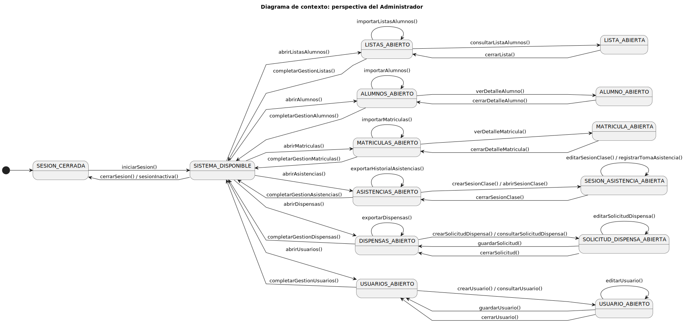

# Análisis del Sistema (Agnóstico)

## Modelos del Dominio
A continuación se presentan los diagramas conceptuales que definen el comportamiento y la estructura del sistema CGU, extraídos del análisis de requisitos.

### Diagrama de Clases

### Diagrama de Estados (Dispensas)

### Diagrama de Contexto

## Actores del Sistema
1. **Secretaría**: Gestión de alumnos y matrículas.
2. **Profesor**: Registro de asistencia.
3. **Alumno**: Solicitud de dispensas.
4. **Director de Grado**: Validación académica y aprobación de dispensas.
