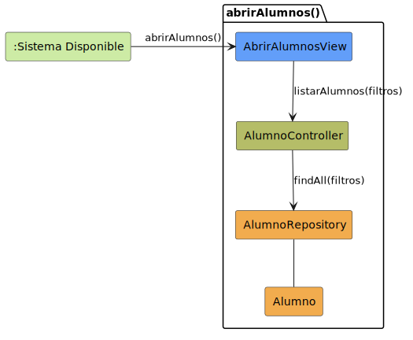

# CGU > abrirAlumnos > Análisis

> | [Inicio](../../../README.md) | [Requisitado](../../requisitado/README.md) | [Índice Análisis](../README.md) | **Análisis** | [Diseño](../../diseño/abrirAlumnos/README.md) |
> |---|---|---|---|---|

**Actor:** Secretaria · Profesor

Permite al actor acceder al listado completo de alumnos registrados en el sistema. La vista solicita al controlador los registros aplicando los filtros indicados, y el repositorio los recupera de la entidad `Alumno`.

---

## Diagrama de colaboración

|  |
| :--- |
| [colaboracion.puml](../../../modelosUML/analisis/abrirAlumnos/colaboracion.puml) |

---

## Clases

| Clase | Tipo |
|-------|------|
| AbrirAlumnosView | Vista |
| AlumnoController | Controlador |
| AlumnoRepository | Modelo |
| Alumno | Modelo |

---

## Flujo de colaboración

1. El sistema está disponible y el actor solicita abrir el módulo de alumnos → se activa `AbrirAlumnosView`
2. `AbrirAlumnosView` solicita a `AlumnoController` el listado de alumnos mediante `listarAlumnos(filtros)`
3. `AlumnoController` delega la consulta en `AlumnoRepository` invocando `findAll(filtros)`
4. `AlumnoRepository` recupera los registros de `Alumno` y los retorna al controlador para que la vista los muestre
