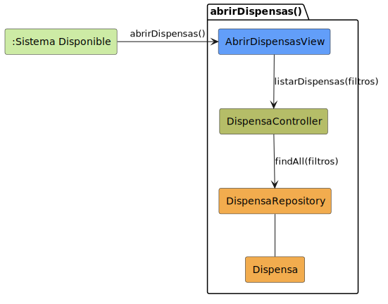

# CGU > abrirDispensas > Análisis

> | [Inicio](../../../README.md) | [Requisitado](../../requisitado/README.md) | [Índice Análisis](../README.md) | **Análisis** | [Diseño](../../diseño/abrirDispensas/README.md) |
> |---|---|---|---|---|

**Actor:** Alumno · Profesor · DirectorDeGrado · Secretaria

Permite al actor acceder al listado de solicitudes de dispensa del sistema. Según el rol, la vista mostrará las dispensas que corresponden al actor autenticado. El repositorio las recupera de la entidad `Dispensa`.

---

## Diagrama de colaboración

|  |
| :--- |
| [colaboracion.puml](../../../modelosUML/analisis/abrirDispensas/colaboracion.puml) |

---

## Clases

| Clase | Tipo |
|-------|------|
| AbrirDispensasView | Vista |
| DispensaController | Controlador |
| DispensaRepository | Modelo |
| Dispensa | Modelo |

---

## Flujo de colaboración

1. El sistema está disponible y el actor solicita abrir el módulo de dispensas → se activa `AbrirDispensasView`
2. `AbrirDispensasView` solicita a `DispensaController` el listado de solicitudes mediante `listarDispensas(filtros)`
3. `DispensaController` delega la consulta en `DispensaRepository` invocando `findAll(filtros)`
4. `DispensaRepository` recupera los registros de `Dispensa` y los retorna al controlador para que la vista los muestre
