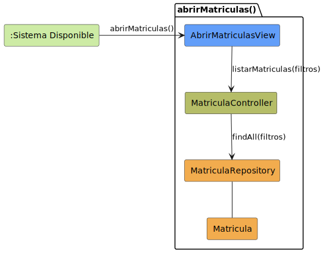

# CGU > abrirMatriculas > Análisis

> | [Inicio](../../../README.md) | [Requisitado](../../requisitado/README.md) | [Índice Análisis](../README.md) | **Análisis** | [Diseño](../../diseño/abrirMatriculas/README.md) |
> |---|---|---|---|---|

**Actor:** Secretaria

Permite a la Secretaria acceder al listado de matrículas registradas en el sistema. La vista solicita al controlador los registros con los filtros indicados, y el repositorio los recupera de la entidad `Matricula`.

---

## Diagrama de colaboración

|  |
| :--- |
| [colaboracion.puml](../../../modelosUML/analisis/abrirMatriculas/colaboracion.puml) |

---

## Clases

| Clase | Tipo |
|-------|------|
| AbrirMatriculasView | Vista |
| MatriculaController | Controlador |
| MatriculaRepository | Modelo |
| Matricula | Modelo |

---

## Flujo de colaboración

1. El sistema está disponible y la Secretaria solicita abrir el módulo de matrículas → se activa `AbrirMatriculasView`
2. `AbrirMatriculasView` solicita a `MatriculaController` el listado de matrículas mediante `listarMatriculas(filtros)`
3. `MatriculaController` delega la consulta en `MatriculaRepository` invocando `findAll(filtros)`
4. `MatriculaRepository` recupera los registros de `Matricula` y los retorna al controlador para que la vista los muestre
