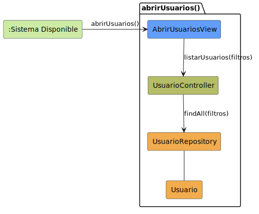

# CGU > abrirUsuarios > Análisis

> | [Inicio](../../../README.md) | [Requisitado](../../requisitado/README.md) | [Índice Análisis](../README.md) | **Análisis** | [Diseño](../../diseño/abrirUsuarios/README.md) | [Desarrollo](../../desarrollo/abrirUsuarios/README.md) |
> |---|---|---|---|---|---|

**Actor:** Administrador

Permite al Administrador acceder al listado de usuarios registrados en el sistema. La vista solicita al controlador los registros con los filtros indicados, y el repositorio los recupera de la entidad `Usuario`.

---

## Diagrama de colaboración

|  |
| :--- |
| [colaboracion.puml](../../../modelosUML/analisis/abrirUsuarios/colaboracion.puml) |

---

## Clases

| Clase | Tipo |
|-------|------|
| AbrirUsuariosView | Vista |
| UsuarioController | Controlador |
| UsuarioRepository | Modelo |
| Usuario | Modelo |

---

## Flujo de colaboración

1. El sistema está disponible y el Administrador solicita abrir el módulo de usuarios → se activa `AbrirUsuariosView`
2. `AbrirUsuariosView` solicita a `UsuarioController` el listado de usuarios mediante `listarUsuarios(filtros)`
3. `UsuarioController` delega la consulta en `UsuarioRepository` invocando `findAll(filtros)`
4. `UsuarioRepository` recupera los registros de `Usuario` y los retorna al controlador para que la vista los muestre
