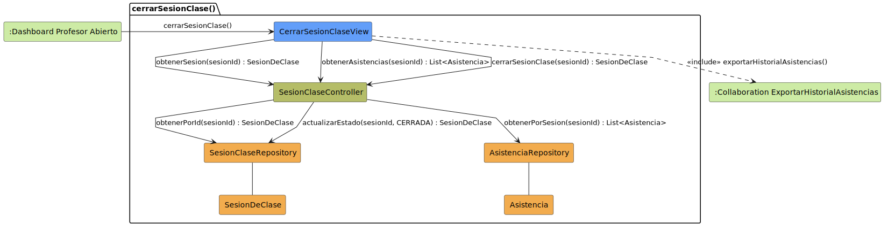

# CGU > cerrarSesionClase > Análisis

> | [Inicio](../../../README.md) | [Requisitado](../../requisitado/README.md) | [Índice Análisis](../README.md) | **Análisis** | [Diseño](../../diseño/cerrarSesionClase/README.md) |
> |---|---|---|---|---|

**Actor:** Profesor

---

## información del artefacto

| Campo | Valor |
|-------|-------|
| **Proyecto** | CGU - Centro de Gestión Universitaria |
| **Disciplina** | Análisis y Diseño |

---

## diagrama de colaboración

> fuente: [colaboracion.puml](../../../modelosUML/analisis/cerrarSesionClase/colaboracion.puml)

---

## clases de análisis identificadas

### clases de vista (boundary)

| Clase | Responsabilidad |
|-------|----------------|
| `CerrarSesionClaseView` | Muestra el resumen de asistencias de la sesión y el control para cerrarla |

### clases de control

| Clase | Responsabilidad |
|-------|----------------|
| `SesionClaseController` | Recupera la sesión y sus asistencias, y ejecuta el cierre actualizando el estado |

### clases de entidad (entity)

| Clase | Responsabilidad |
|-------|----------------|
| `SesionClaseRepository` | Obtiene la sesión por id y actualiza su estado a CERRADA |
| `AsistenciaRepository` | Recupera los registros de asistencia de la sesión |
| `SesionDeClase` | Entidad de dominio con fecha, aula, duración y estado |
| `Asistencia` | Entidad de dominio con el registro de presencia por alumno |

---

## flujo de colaboración

1. El Profesor accede desde `:Dashboard Profesor Abierto` → se abre `CerrarSesionClaseView`.
2. `CerrarSesionClaseView` → `SesionClaseController.obtenerSesion(sesionId)` → `SesionClaseRepository.obtenerPorId(sesionId)` → devuelve `SesionDeClase`.
3. `CerrarSesionClaseView` → `SesionClaseController.obtenerAsistencias(sesionId)` → `AsistenciaRepository.obtenerPorSesion(sesionId)` → devuelve `List<Asistencia>` para mostrar el resumen.
4. El Profesor confirma el cierre → `CerrarSesionClaseView` → `SesionClaseController.cerrarSesionClase(sesionId)` → `SesionClaseRepository.actualizarEstado(sesionId, CERRADA)` → devuelve `SesionDeClase` cerrada.
5. `CerrarSesionClaseView` incluye `<<include>> exportarHistorialAsistencias()` para generar el informe.

---

## referencias

- [Índice de análisis](../README.md)
- [Diseño de este caso](../../diseño/cerrarSesionClase/README.md)
- [Modelo del dominio](../../requisitado/00-modelo-del-dominio/README.md)
- [colaboracion.puml](../../../modelosUML/analisis/cerrarSesionClase/colaboracion.puml)
