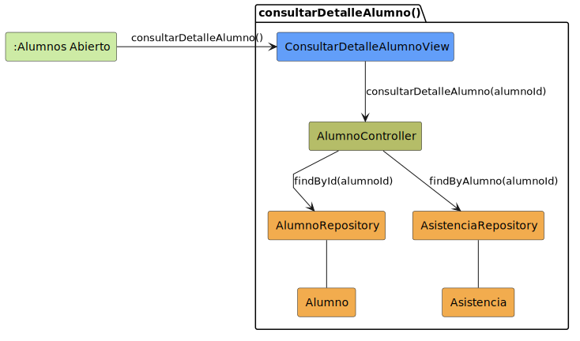

# CGU > consultarDetalleAlumno > Análisis

> | [Inicio](../../../README.md) | [Casos de Uso](../../requisitado/README.md) | [Índice Análisis](../README.md) | **Análisis** | [Diseño](../../diseño/consultarDetalleAlumno/README.md) |
> |---|---|---|---|---|

**Actor:** Profesor

---

## información del artefacto

| Campo | Valor |
|-------|-------|
| **Proyecto** | CGU - Centro de Gestión Universitaria |
| **Disciplina** | Análisis y Diseño |

---

## diagrama de colaboración

> fuente: [colaboracion.puml](../../../modelosUML/analisis/consultarDetalleAlumno/colaboracion.puml)

---

## clases de análisis identificadas

### clases de vista (boundary)

| Clase | Responsabilidad |
|-------|----------------|
| `ConsultarDetalleAlumnoView` | Muestra los datos del alumno y su historial de asistencias |

### clases de control

| Clase | Responsabilidad |
|-------|----------------|
| `AlumnoController` | Recupera los datos del alumno y sus registros de asistencia |

### clases de entidad (entity)

| Clase | Responsabilidad |
|-------|----------------|
| `AlumnoRepository` | Obtiene los datos del alumno por id |
| `AsistenciaRepository` | Obtiene el historial de asistencias del alumno |
| `Alumno` | Entidad de dominio con los datos del estudiante |
| `Asistencia` | Entidad de dominio con el registro de asistencia por sesión |

---

## flujo de colaboración

1. El Profesor accede desde `:Dashboard Profesor Abierto` → se abre `ConsultarDetalleAlumnoView`.
2. `ConsultarDetalleAlumnoView` → `AlumnoController.obtenerAlumno(alumnoId)` → `AlumnoRepository.obtenerPorId(alumnoId)` → devuelve `Alumno`.
3. `ConsultarDetalleAlumnoView` → `AlumnoController.obtenerAsistencias(alumnoId)` → `AsistenciaRepository.obtenerPorAlumno(alumnoId)` → devuelve `List<Asistencia>`.

---

## referencias

- [Índice de análisis](../README.md)
- [Diseño de este caso](../../diseño/consultarDetalleAlumno/README.md)
- [Modelo del dominio](../../requisitado/00-modelo-del-dominio/README.md)
- [colaboracion.puml](../../../modelosUML/analisis/consultarDetalleAlumno/colaboracion.puml)
