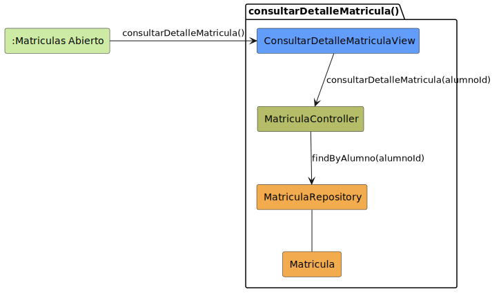

# CGU > consultarDetalleMatricula > Análisis

> | [Inicio](../../../README.md) | [Requisitado](../../requisitado/README.md) | [Índice Análisis](../README.md) | **Análisis** | [Diseño](../../diseño/consultarDetalleMatricula/README.md) |
> |---|---|---|---|---|

**Actor:** SecretariaAcademica

---

## información del artefacto

| Campo | Valor |
|-------|-------|
| **Proyecto** | CGU - Centro de Gestión Universitaria |
| **Disciplina** | Análisis y Diseño |

---

## diagrama de colaboración

> fuente: [colaboracion.puml](../../../modelosUML/analisis/consultarDetalleMatricula/colaboracion.puml)

---

## clases de análisis identificadas

### clases de vista (boundary)

| Clase | Responsabilidad |
|-------|----------------|
| `ConsultarDetalleMatriculaView` | Muestra el buscador de matrículas y el detalle de la seleccionada con datos del alumno |

### clases de control

| Clase | Responsabilidad |
|-------|----------------|
| `MatriculaController` | Busca matrículas por filtro, recupera el detalle y los datos del alumno asociado |

### clases de entidad (entity)

| Clase | Responsabilidad |
|-------|----------------|
| `MatriculaRepository` | Consulta matrículas por filtro y por id |
| `AlumnoRepository` | Obtiene los datos del alumno vinculado a la matrícula |
| `Matricula` | Entidad de dominio que vincula alumno con asignatura |
| `Alumno` | Entidad de dominio con los datos del estudiante |

---

## flujo de colaboración

1. La Secretaria accede desde `:Dashboard Secretaria Abierto` → se abre `ConsultarDetalleMatriculaView`.
2. `ConsultarDetalleMatriculaView` → `MatriculaController.buscarMatriculas(filtro)` → `MatriculaRepository.buscarPorFiltro(filtro)` → devuelve `List<Matricula>`.
3. La Secretaria selecciona una matrícula → `ConsultarDetalleMatriculaView` → `MatriculaController.obtenerDetalle(matriculaId)` → `MatriculaRepository.obtenerPorId(matriculaId)` → devuelve `Matricula`.
4. `ConsultarDetalleMatriculaView` → `MatriculaController.obtenerAlumno(alumnoId)` → `AlumnoRepository.obtenerPorId(alumnoId)` → devuelve `Alumno`.

---

## referencias

- [Índice de análisis](../README.md)
- [Diseño de este caso](../../diseño/consultarDetalleMatricula/README.md)
- [Modelo del dominio](../../requisitado/00-modelo-del-dominio/README.md)
- [colaboracion.puml](../../../modelosUML/analisis/consultarDetalleMatricula/colaboracion.puml)
