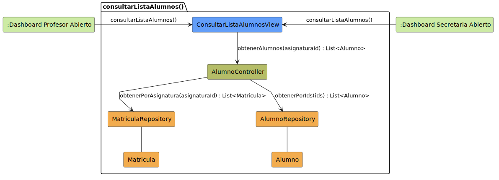

# CGU > consultarListaAlumnos > Análisis

> | [Inicio](../../../README.md) | [Requisitado](../../requisitado/README.md) | [índice Análisis](../README.md) | **Análisis** | [Diseño](../../diseño/consultarListaAlumnos/README.md) |
> |---|---|---|---|---|

**Actores:** Profesor · SecretariaAcadémica

---

## información del artefacto

| Campo | Valor |
|-------|-------|
| **Proyecto** | CGU - Centro de Gestión Universitaria |
| **Disciplina** | Análisis y Diseño |

---

## diagrama de colaboración

> fuente: [colaboracion.puml](../../../modelosUML/analisis/consultarListaAlumnos/colaboracion.puml)

---

## clases de análisis identificadas

### clases de vista (boundary)

| Clase | Responsabilidad |
|-------|----------------|
| `ConsultarListaAlumnosView` | Muestra la lista de alumnos filtrada por asignatura |

### clases de control

| Clase | Responsabilidad |
|-------|----------------|
| `AlumnoController` | Obtiene los ids de alumnos matriculados y recupera sus datos |

### clases de entidad (entity)

| Clase | Responsabilidad |
|-------|----------------|
| `MatriculaRepository` | Obtiene las matrículas asociadas a una asignatura |
| `AlumnoRepository` | Obtiene los datos de los alumnos por sus ids |
| `Matricula` | Entidad de dominio que vincula alumno con asignatura |
| `Alumno` | Entidad de dominio con los datos del estudiante |

---

## flujo de colaboración

1. El Profesor o la Secretaria accede desde su dashboard → se abre `ConsultarListaAlumnosView`.
2. `ConsultarListaAlumnosView` → `AlumnoController.obtenerAlumnos(asignaturaId)`.
3. `AlumnoController` → `MatriculaRepository.obtenerPorAsignatura(asignaturaId)` → devuelve `List<Matricula>`.
4. `AlumnoController` → `AlumnoRepository.obtenerPorIds(ids)` → devuelve `List<Alumno>`.
5. `ConsultarListaAlumnosView` muestra la lista resultante.

---

## referencias

- [índice de análisis](../README.md)
- [Diseño de este caso](../../diseño/consultarListaAlumnos/README.md)
- [Modelo del dominio](../../requisitado/00-modelo-del-dominio/README.md)
- [colaboracion.puml](../../../modelosUML/analisis/consultarListaAlumnos/colaboracion.puml)