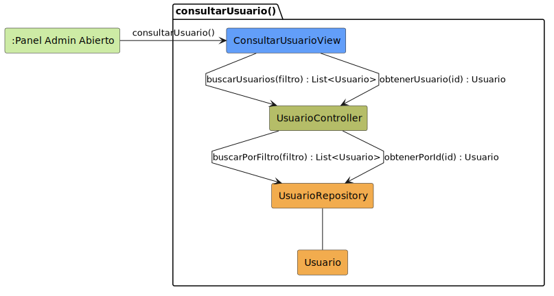

# CGU > consultarUsuario > Análisis

> | [Inicio](../../../README.md) | [Requisitado](../../requisitado/README.md) | [Índice Análisis](../README.md) | **Análisis** | [Diseño](../../diseño/consultarUsuario/README.md) | [Desarrollo](../../desarrollo/consultarUsuario/README.md) |
> |---|---|---|---|---|---|

**Actor:** Administrador

Permite al Administrador consultar los datos de un usuario concreto seleccionado desde el listado: nombre completo, DNI, correo electrónico, rol en el sistema y estado de la cuenta.

---

## Diagrama de colaboración

|  |
| :--- |
| [colaboracion.puml](../../../modelosUML/analisis/consultarUsuario/colaboracion.puml) |

---

## Clases

| Clase | Tipo |
|-------|------|
| ConsultarUsuarioView | Vista |
| UsuarioController | Controlador |
| UsuarioRepository | Modelo |
| Usuario | Modelo |

---

## Flujo de colaboración

1. El Administrador selecciona un usuario del listado → se activa `ConsultarUsuarioView`
2. `ConsultarUsuarioView` solicita a `UsuarioController` los datos del usuario mediante `consultarUsuario(usuarioId)`
3. `UsuarioController` delega la búsqueda en `UsuarioRepository` invocando `findById(usuarioId)`
4. `UsuarioRepository` recupera el registro de `Usuario` y lo retorna al controlador para mostrarlo en la vista
