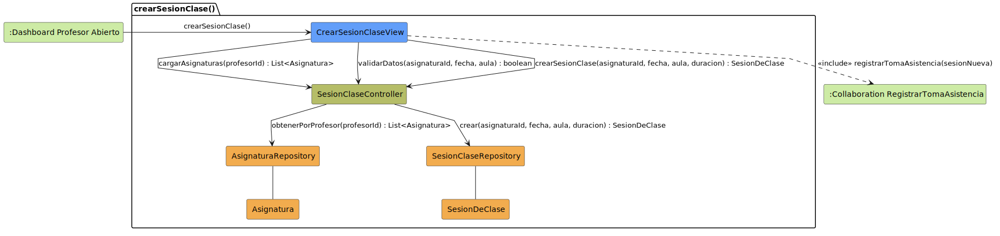

# CGU > crearSesionClase > Análisis

> | [Inicio](../../../README.md) | [Requisitado](../../requisitado/README.md) | [Índice Análisis](../README.md) | **Análisis** | [Diseño](../../diseño/crearSesionClase/README.md) |
> |---|---|---|---|---|

**Actor:** Profesor

---

## información del artefacto

| Campo | Valor |
|-------|-------|
| **Proyecto** | CGU - Centro de Gestión Universitaria |
| **Disciplina** | Análisis y Diseño |

---

## diagrama de colaboración

> fuente: [colaboracion.puml](../../../modelosUML/analisis/crearSesionClase/colaboracion.puml)

---

## clases de análisis identificadas

### clases de vista (boundary)

| Clase | Responsabilidad |
|-------|----------------|
| `CrearSesionClaseView` | Formulario de nueva sesión; muestra asignaturas disponibles y recoge fecha, aula y duración |

### clases de control

| Clase | Responsabilidad |
|-------|----------------|
| `SesionClaseController` | Carga asignaturas del profesor, valida los datos y orquesta la creación de la sesión |

### clases de entidad (entity)

| Clase | Responsabilidad |
|-------|----------------|
| `AsignaturaRepository` | Recupera las asignaturas asignadas al profesor |
| `SesionClaseRepository` | Persiste la nueva sesión de clase |
| `Asignatura` | Entidad de dominio que representa una asignatura |
| `SesionDeClase` | Entidad de dominio con fecha, aula, duración y estado |

---

## flujo de colaboración

1. El Profesor accede desde `:Dashboard Profesor Abierto` → se abre `CrearSesionClaseView`.
2. `CrearSesionClaseView` → `SesionClaseController.cargarAsignaturas(profesorId)` → `AsignaturaRepository.obtenerPorProfesor(profesorId)` → devuelve `List<Asignatura>`.
3. `CrearSesionClaseView` → `SesionClaseController.validarDatos(asignaturaId, fecha, aula)`.
4. Si los datos son válidos, `CrearSesionClaseView` → `SesionClaseController.crearSesionClase(asignaturaId, fecha, aula, duracion)` → `SesionClaseRepository.crear(...)` → devuelve `SesionDeClase`.
5. `CrearSesionClaseView` incluye `<<include>> registrarTomaAsistencia(sesionNueva)` para iniciar el pase de lista.

---

## referencias

- [Índice de análisis](../README.md)
- [Diseño de este caso](../../diseño/crearSesionClase/README.md)
- [Modelo del dominio](../../requisitado/00-modelo-del-dominio/README.md)
- [colaboracion.puml](../../../modelosUML/analisis/crearSesionClase/colaboracion.puml)
