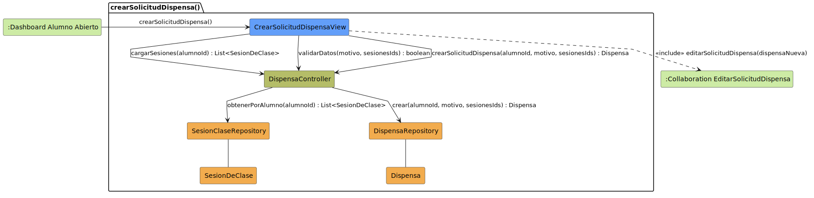

# CGU > crearSolicitudDispensa > Análisis

> | [Inicio](../../../README.md) | [Casos de Uso](../../requisitado/README.md) | [índice Análisis](../README.md) | **Análisis** | [Diseño](../../diseño/crearSolicitudDispensa/README.md) |
> |---|---|---|---|---|

**Actores:** Alumno · SecretariaAcadémica

---

## información del artefacto

| Campo | Valor |
|-------|-------|
| **Proyecto** | CGU - Centro de Gestión Universitaria |
| **Disciplina** | Análisis y Diseño |

---

## diagrama de colaboración

> fuente: [colaboracion.puml](../../../modelosUML/analisis/crearSolicitudDispensa/colaboracion.puml)

---

## clases de análisis identificadas

### clases de vista (boundary)

| Clase | Responsabilidad |
|-------|----------------|
| `CrearSolicitudDispensaView` | Formulario de nueva dispensa; muestra sesiones disponibles del alumno y recoge el motivo |

### clases de control

| Clase | Responsabilidad |
|-------|----------------|
| `DispensaController` | Carga las sesiones del alumno, valida los datos y orquesta la creación de la solicitud |

### clases de entidad (entity)

| Clase | Responsabilidad |
|-------|----------------|
| `SesionClaseRepository` | Recupera las sesiones de clase asociadas al alumno |
| `DispensaRepository` | Persiste la nueva solicitud de dispensa |
| `SesionDeClase` | Entidad de dominio que representa una sesión a la que se solicita dispensa |
| `Dispensa` | Entidad de dominio con motivo, alumno, sesiones y estado |

---

## flujo de colaboración

1. El Alumno accede desde `:Dashboard Alumno Abierto` → se abre `CrearSolicitudDispensaView`.
2. `CrearSolicitudDispensaView` → `DispensaController.cargarSesiones(alumnoId)` → `SesionClaseRepository.obtenerPorAlumno(alumnoId)` → devuelve `List<SesionDeClase>`.
3. `CrearSolicitudDispensaView` → `DispensaController.validarDatos(motivo, sesionesIds)`.
4. Si los datos son válidos, `CrearSolicitudDispensaView` → `DispensaController.crearSolicitudDispensa(alumnoId, motivo, sesionesIds)` → `DispensaRepository.crear(...)` → devuelve `Dispensa`.
5. `CrearSolicitudDispensaView` incluye `<<include>> editarSolicitudDispensa(dispensaNueva)` para revisar o completar la solicitud.

---

## referencias

- [índice de análisis](../README.md)
- [Diseño de este caso](../../diseño/crearSolicitudDispensa/README.md)
- [Modelo del dominio](../../requisitado/00-modelo-del-dominio/README.md)
- [colaboracion.puml](../../../modelosUML/analisis/crearSolicitudDispensa/colaboracion.puml)