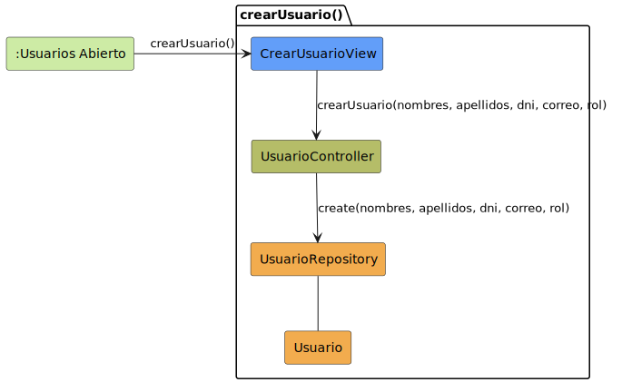

# CGU > crearUsuario > Análisis

> | [Inicio](../../../README.md) | [Requisitado](../../requisitado/README.md) | [Índice Análisis](../README.md) | **Análisis** | [Diseño](../../diseño/crearUsuario/README.md) |
> |---|---|---|---|---|

**Actor:** Administrador

---

## información del artefacto

| Campo | Valor |
|-------|-------|
| **Proyecto** | CGU - Centro de Gestión Universitaria |
| **Disciplina** | Análisis y Diseño |

---

## diagrama de colaboración

> fuente: [colaboracion.puml](../../../modelosUML/analisis/crearUsuario/colaboracion.puml)

---

## clases de análisis identificadas

### clases de vista (boundary)

| Clase | Responsabilidad |
|-------|----------------|
| `CrearUsuarioView` | Formulario de alta de usuario; recoge nombre, email, password y rol |

### clases de control

| Clase | Responsabilidad |
|-------|----------------|
| `UsuarioController` | Valida los datos del formulario y orquesta la creación en repositorio |

### clases de entidad (entity)

| Clase | Responsabilidad |
|-------|----------------|
| `UsuarioRepository` | Verifica unicidad de email y persiste el nuevo usuario |
| `Usuario` | Entidad de dominio con nombre, email, password y rol |

---

## flujo de colaboración

1. El Administrador accede desde `:Panel Admin Abierto` → se abre `CrearUsuarioView`.
2. `CrearUsuarioView` → `UsuarioController.validarDatos(nombre, email, rol)` → `UsuarioRepository.verificarUnicidad(email)`.
3. Si los datos son válidos, `CrearUsuarioView` → `UsuarioController.crearUsuario(nombre, email, password, rol)` → `UsuarioRepository.crear(...)` → devuelve `Usuario`.
4. `CrearUsuarioView` incluye `<<include>> editarUsuario(usuarioNuevo)` para completar el alta.

---

## referencias

- [Índice de análisis](../README.md)
- [Diseño de este caso](../../diseño/crearUsuario/README.md)
- [Modelo del dominio](../../requisitado/00-modelo-del-dominio/README.md)
- [colaboracion.puml](../../../modelosUML/analisis/crearUsuario/colaboracion.puml)
