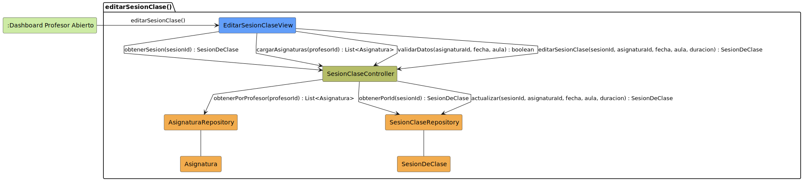

# CGU > editarSesionClase > Análisis

> | [Inicio](../../../README.md) | [Requisitado](../../requisitado/README.md) | [Índice Análisis](../README.md) | **Análisis** | [Diseño](../../diseño/editarSesionClase/README.md) |
> |---|---|---|---|---|

**Actor:** Profesor

Permite al Profesor modificar los datos de una sesión de clase: asignatura, fecha, hora de inicio, hora de fin y tipo. El sistema precarga los datos actuales de la sesión y las asignaturas disponibles antes de habilitar la edición.

---

## Diagrama de colaboración

|  |
| :--- |
| [colaboracion.puml](../../../modelosUML/analisis/editarSesionClase/colaboracion.puml) |

---

## Clases

| Clase | Tipo |
|-------|------|
| EditarSesionClaseView | Vista |
| SesionClaseController | Controlador |
| AsignaturaRepository | Modelo |
| SesionClaseRepository | Modelo |
| Asignatura | Modelo |
| SesionDeClase | Modelo |

---

## Flujo de colaboración

1. El Profesor solicita editar la sesión → se activa `EditarSesionClaseView`
2. `EditarSesionClaseView` solicita a `SesionClaseController` los datos actuales mediante `obtenerSesion(sesionId)` para precargar el formulario
3. `SesionClaseController` consulta `SesionClaseRepository.findById(sesionId)` para recuperar la sesión
4. `SesionClaseRepository` accede a `SesionDeClase` y retorna los datos al controlador
5. `EditarSesionClaseView` solicita a `SesionClaseController` las asignaturas disponibles mediante `cargarAsignaturas(profesorId)`
6. `SesionClaseController` consulta `AsignaturaRepository.findByProfesor(profesorId)` para obtener las opciones del selector
7. `AsignaturaRepository` accede a `Asignatura` y retorna el listado
8. El Profesor modifica los campos y confirma → `EditarSesionClaseView` invoca `SesionClaseController.editarSesionClase(sesionId, asignaturaId, fecha, horaInicio, horaFin, tipo)`
9. `SesionClaseController` ordena a `SesionClaseRepository` persistir los cambios invocando `update(sesionId, datos)`
