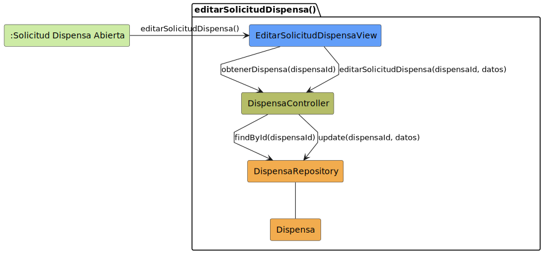

# CGU > editarSolicitudDispensa > Análisis

> | [Inicio](../../../README.md) | [Requisitado](../../requisitado/README.md) | [Índice Análisis](../README.md) | **Análisis** | [Diseño](../../diseño/editarSolicitudDispensa/README.md) |
> |---|---|---|---|---|

**Actor:** Alumno · DirectorDeGrado · Secretaria

---

## Diagrama de colaboración

|  |
| :--- |
| [colaboracion.puml](../../../modelosUML/analisis/editarSolicitudDispensa/colaboracion.puml) |
