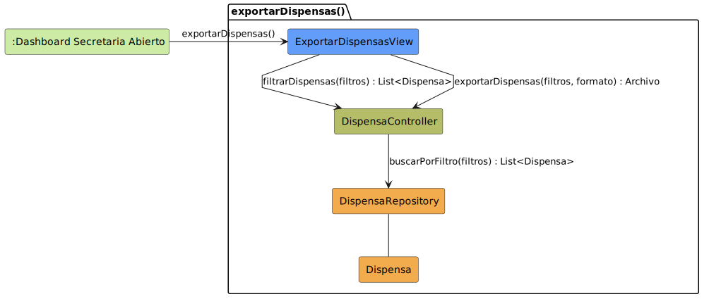

# CGU > exportarDispensas > Análisis

> | [Inicio](../../../README.md) | [Requisitado](../../requisitado/README.md) | [Índice Análisis](../README.md) | **Análisis** | [Diseño](../../diseño/exportarDispensas/README.md) |
> |---|---|---|---|---|

**Actor:** SecretariaAcademica

---

## información del artefacto

| Campo | Valor |
|-------|-------|
| **Proyecto** | CGU - Centro de Gestión Universitaria |
| **Disciplina** | Análisis y Diseño |

---

## diagrama de colaboración

> fuente: [colaboracion.puml](../../../modelosUML/analisis/exportarDispensas/colaboracion.puml)

---

## clases de análisis identificadas

### clases de vista (boundary)

| Clase | Responsabilidad |
|-------|----------------|
| `ExportarDispensasView` | Muestra el listado de dispensas filtrado y permite a la Secretaria generar y descargar el informe |

### clases de control

| Clase | Responsabilidad |
|-------|----------------|
| `DispensaController` | Aplica los filtros sobre el repositorio de dispensas y genera el archivo de exportación |

### clases de entidad (entity)

| Clase | Responsabilidad |
|-------|----------------|
| `DispensaRepository` | Recupera las dispensas que cumplen los criterios de búsqueda |
| `Dispensa` | Entidad de dominio con motivo, alumno, asignaturas y estado |

---

## flujo de colaboración

1. La Secretaria accede desde `:Dashboard Secretaria Abierto` → se abre `ExportarDispensasView`.
2. La Secretaria introduce los filtros (curso, asignatura, estado) → `ExportarDispensasView` → `DispensaController.filtrarDispensas(filtros)` → `DispensaRepository.buscarPorFiltro(filtros)` → devuelve `List<Dispensa>`.
3. La Secretaria selecciona el formato → `ExportarDispensasView` → `DispensaController.exportarDispensas(filtros, formato)` → devuelve `Archivo` para su descarga.

---

## referencias

- [Índice de análisis](../README.md)
- [Diseño de este caso](../../diseño/exportarDispensas/README.md)
- [Modelo del dominio](../../requisitado/00-modelo-del-dominio/README.md)
- [colaboracion.puml](../../../modelosUML/analisis/exportarDispensas/colaboracion.puml)
