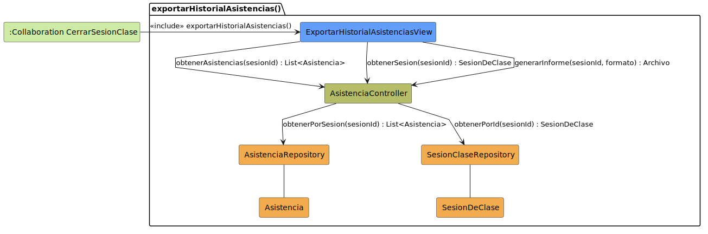

# CGU > exportarHistorialAsistencias > Análisis

> | [Inicio](../../../README.md) | [Requisitado](../../requisitado/README.md) | [Índice Análisis](../README.md) | **Análisis** | [Diseño](../../diseño/exportarHistorialAsistencias/README.md) |
> |---|---|---|---|---|

**Actor:** Profesor

---

## información del artefacto

| Campo | Valor |
|-------|-------|
| **Proyecto** | CGU - Centro de Gestión Universitaria |
| **Disciplina** | Análisis y Diseño |

---

## diagrama de colaboración

> fuente: [colaboracion.puml](../../../modelosUML/analisis/exportarHistorialAsistencias/colaboracion.puml)

---

## clases de análisis identificadas

### clases de vista (boundary)

| Clase | Responsabilidad |
|-------|----------------|
| `ExportarHistorialAsistenciasView` | Muestra el resumen de asistencias de la sesión y permite al Profesor generar y descargar el informe en el formato elegido |

### clases de control

| Clase | Responsabilidad |
|-------|----------------|
| `AsistenciaController` | Recupera las asistencias y los datos de la sesión, y genera el archivo de informe |

### clases de entidad (entity)

| Clase | Responsabilidad |
|-------|----------------|
| `AsistenciaRepository` | Recupera los registros de asistencia de la sesión |
| `SesionClaseRepository` | Obtiene los datos de la sesión (fecha, aula, asignatura) para el encabezado del informe |
| `Asistencia` | Entidad de dominio con el registro de presencia por alumno |
| `SesionDeClase` | Entidad de dominio con fecha, aula, duración y estado |

---

## flujo de colaboración

1. `ExportarHistorialAsistenciasView` se activa por `<<include>>` desde `cerrarSesionClase()`.
2. `ExportarHistorialAsistenciasView` → `AsistenciaController.obtenerAsistencias(sesionId)` → `AsistenciaRepository.obtenerPorSesion(sesionId)` → devuelve `List<Asistencia>`.
3. `ExportarHistorialAsistenciasView` → `AsistenciaController.obtenerSesion(sesionId)` → `SesionClaseRepository.obtenerPorId(sesionId)` → devuelve `SesionDeClase`.
4. El Profesor selecciona el formato → `ExportarHistorialAsistenciasView` → `AsistenciaController.generarInforme(sesionId, formato)` → devuelve `Archivo` para su descarga.

---

## referencias

- [Índice de análisis](../README.md)
- [Diseño de este caso](../../diseño/exportarHistorialAsistencias/README.md)
- [Modelo del dominio](../../requisitado/00-modelo-del-dominio/README.md)
- [colaboracion.puml](../../../modelosUML/analisis/exportarHistorialAsistencias/colaboracion.puml)
