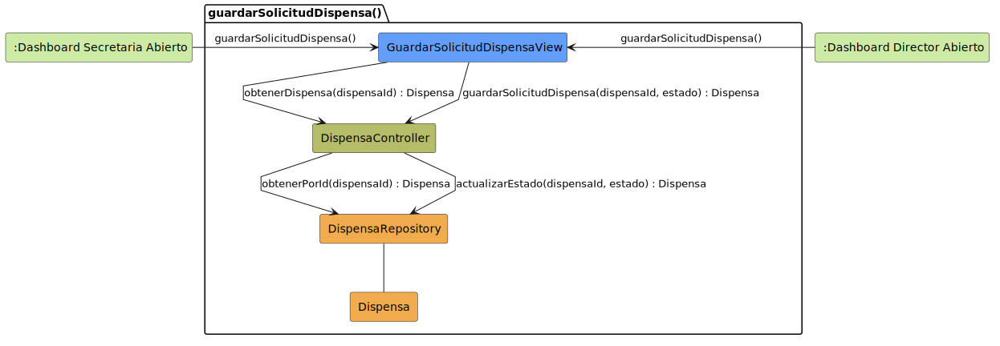

# CGU > guardarSolicitudDispensa > Análisis

> | [Inicio](../../../README.md) | [Requisitado](../../requisitado/README.md) | [índice Análisis](../README.md) | **Análisis** | [Diseño](../../diseño/guardarSolicitudDispensa/README.md) |
> |---|---|---|---|---|

**Actores:** SecretariaAcadémica · DirectorDeGrado

---

## información del artefacto

| Campo | Valor |
|-------|-------|
| **Proyecto** | CGU - Centro de Gestión Universitaria |
| **Disciplina** | Análisis y Diseño |

---

## diagrama de colaboración

> fuente: [colaboracion.puml](../../../modelosUML/analisis/guardarSolicitudDispensa/colaboracion.puml)

---

## clases de análisis identificadas

### clases de vista (boundary)

| Clase | Responsabilidad |
|-------|----------------|
| `GuardarSolicitudDispensaView` | Muestra el resumen de la dispensa y el control para confirmar el estado final |

### clases de control

| Clase | Responsabilidad |
|-------|----------------|
| `DispensaController` | Recupera la dispensa y persiste el cambio de estado |

### clases de entidad (entity)

| Clase | Responsabilidad |
|-------|----------------|
| `DispensaRepository` | Obtiene la dispensa por id y actualiza su estado |
| `Dispensa` | Entidad de dominio con motivo, alumno, sesiones y estado |

---

## flujo de colaboración

1. La Secretaria o el Director acceden desde su dashboard → se abre `GuardarSolicitudDispensaView`.
2. `GuardarSolicitudDispensaView` → `DispensaController.obtenerDispensa(dispensaId)` → `DispensaRepository.obtenerPorId(dispensaId)` → devuelve `Dispensa` para mostrar el resumen.
3. El actor confirma el estado → `GuardarSolicitudDispensaView` → `DispensaController.guardarSolicitudDispensa(dispensaId, estado)` → `DispensaRepository.actualizarEstado(dispensaId, estado)` → devuelve `Dispensa` actualizada.

---

## referencias

- [índice de análisis](../README.md)
- [Diseño de este caso](../../diseño/guardarSolicitudDispensa/README.md)
- [Modelo del dominio](../../requisitado/00-modelo-del-dominio/README.md)
- [colaboracion.puml](../../../modelosUML/analisis/guardarSolicitudDispensa/colaboracion.puml)