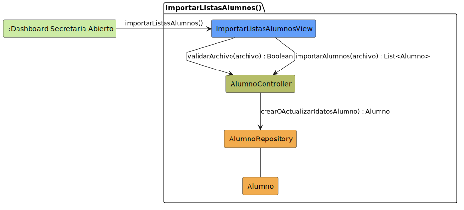

# CGU > importarListasAlumnos > Análisis

> | [Inicio](../../../README.md) | [Requisitado](../../requisitado/README.md) | [Índice Análisis](../README.md) | **Análisis** | [Diseño](../../diseño/importarListasAlumnos/README.md) |
> |---|---|---|---|---|

**Actor:** SecretariaAcademica

---

## información del artefacto

| Campo | Valor |
|-------|-------|
| **Proyecto** | CGU - Centro de Gestión Universitaria |
| **Disciplina** | Análisis y Diseño |

---

## diagrama de colaboración

> fuente: [colaboracion.puml](../../../modelosUML/analisis/importarListasAlumnos/colaboracion.puml)

---

## clases de análisis identificadas

### clases de vista (boundary)

| Clase | Responsabilidad |
|-------|----------------|
| `ImportarListasAlumnosView` | Permite a la Secretaria subir el archivo con la lista de alumnos y muestra el informe de importación |

### clases de control

| Clase | Responsabilidad |
|-------|----------------|
| `AlumnoController` | Valida el formato del archivo y orquesta la creación o actualización de cada registro de alumno |

### clases de entidad (entity)

| Clase | Responsabilidad |
|-------|----------------|
| `AlumnoRepository` | Crea o actualiza el registro de un alumno en la base de datos |
| `Alumno` | Entidad de dominio con los datos del estudiante |

---

## flujo de colaboración

1. La Secretaria accede desde `:Dashboard Secretaria Abierto` → se abre `ImportarListasAlumnosView`.
2. La Secretaria selecciona el archivo → `ImportarListasAlumnosView` → `AlumnoController.validarArchivo(archivo)` → devuelve `Boolean` indicando si el formato es correcto.
3. Si el archivo es válido → `ImportarListasAlumnosView` → `AlumnoController.importarAlumnos(archivo)` → `AlumnoRepository.crearOActualizar(datosAlumno)` por cada fila → devuelve `List<Alumno>`.
4. `ImportarListasAlumnosView` muestra el informe de importación con los registros procesados y los errores detectados.

---

## referencias

- [Índice de análisis](../README.md)
- [Diseño de este caso](../../diseño/importarListasAlumnos/README.md)
- [Modelo del dominio](../../requisitado/00-modelo-del-dominio/README.md)
- [colaboracion.puml](../../../modelosUML/analisis/importarListasAlumnos/colaboracion.puml)
