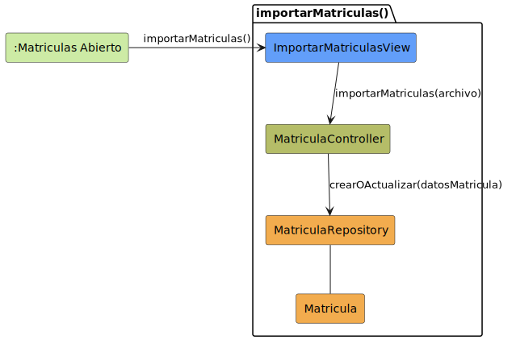

# CGU > importarMatriculas > Análisis

> | [Inicio](../../../README.md) | [Requisitado](../../requisitado/README.md) | [Índice Análisis](../README.md) | **Análisis** | [Diseño](../../diseño/importarMatriculas/README.md) |
> |---|---|---|---|---|

**Actor:** SecretariaAcademica

---

## información del artefacto

| Campo | Valor |
|-------|-------|
| **Proyecto** | CGU - Centro de Gestión Universitaria |
| **Disciplina** | Análisis y Diseño |

---

## diagrama de colaboración

> fuente: [colaboracion.puml](../../../modelosUML/analisis/importarMatriculas/colaboracion.puml)

---

## clases de análisis identificadas

### clases de vista (boundary)

| Clase | Responsabilidad |
|-------|----------------|
| `ImportarMatriculasView` | Permite a la Secretaria subir el archivo de matrículas y muestra el informe de importación |

### clases de control

| Clase | Responsabilidad |
|-------|----------------|
| `MatriculaController` | Valida el archivo, localiza cada alumno por DNI y orquesta la creación o actualización de sus matrículas |

### clases de entidad (entity)

| Clase | Responsabilidad |
|-------|----------------|
| `AlumnoRepository` | Recupera el alumno a partir de su DNI para asociarlo a la matrícula |
| `MatriculaRepository` | Crea o actualiza el registro de matrícula de un alumno en una asignatura |
| `Alumno` | Entidad de dominio con los datos del estudiante |
| `Matricula` | Entidad de dominio con la relación alumno-asignatura y su estado |

---

## flujo de colaboración

1. La Secretaria accede desde `:Dashboard Secretaria Abierto` → se abre `ImportarMatriculasView`.
2. La Secretaria selecciona el archivo → `ImportarMatriculasView` → `MatriculaController.validarArchivo(archivo)` → devuelve `Boolean` indicando si el formato es correcto.
3. Si el archivo es válido → `ImportarMatriculasView` → `MatriculaController.importarMatriculas(archivo)` → por cada fila: `AlumnoRepository.obtenerPorDni(dni)` → devuelve `Alumno`.
4. Con el alumno localizado → `MatriculaController` → `MatriculaRepository.crearOActualizar(alumnoId, asignaturaId)` → devuelve `Matricula`.
5. `ImportarMatriculasView` muestra el informe de importación con los registros procesados y los errores detectados.

---

## referencias

- [Índice de análisis](../README.md)
- [Diseño de este caso](../../diseño/importarMatriculas/README.md)
- [Modelo del dominio](../../requisitado/00-modelo-del-dominio/README.md)
- [colaboracion.puml](../../../modelosUML/analisis/importarMatriculas/colaboracion.puml)
