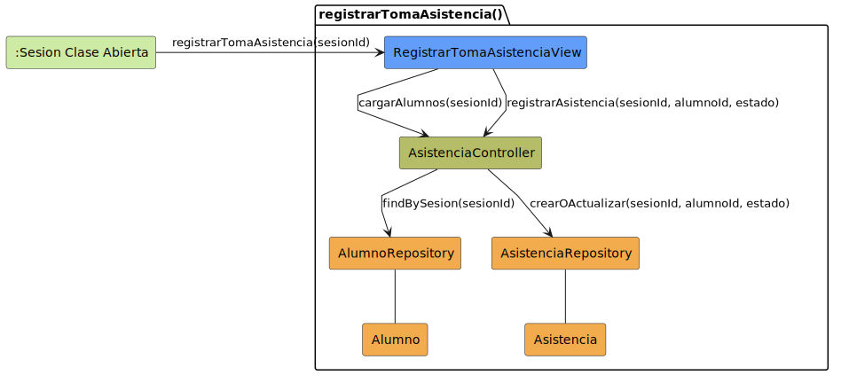

# CGU > registrarTomaAsistencia > Análisis

> | [Inicio](../../../README.md) | [Requisitado](../../requisitado/README.md) | [Índice Análisis](../README.md) | **Análisis** | [Diseño](../../diseño/registrarTomaAsistencia/README.md) |
> |---|---|---|---|---|

**Actor:** Profesor

---

## Diagrama de colaboración

|  |
| :--- |
| [colaboracion.puml](../../../modelosUML/analisis/registrarTomaAsistencia/colaboracion.puml) |
