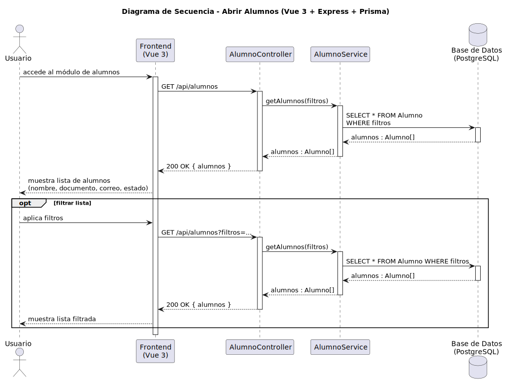

# CGU > abrirAlumnos > Diseño

> | [Inicio](../../../README.md) | [Requisitado](../../requisitado/README.md) | [Análisis](../../analisis/abrirAlumnos/README.md) | [Índice Diseño](../README.md) | **Diseño** |
> |---|---|---|---|---|

**Actor:** Secretaria · Profesor

---

## Diagrama de secuencia

|  |
| :--- |
| [secuencia.puml](../../../modelosUML/diseño/abrirAlumnos/secuencia.puml) |
