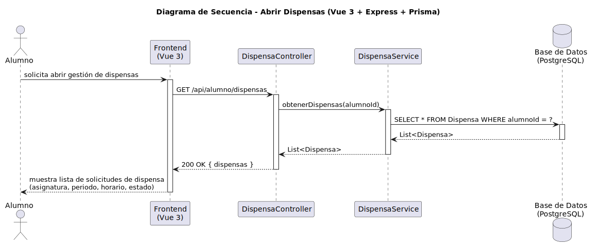

# CGU > abrirDispensas > Diseño

> | [Inicio](../../../README.md) | [Requisitado](../../requisitado/README.md) | [Análisis](../../analisis/abrirDispensas/README.md) | [Índice Diseño](../README.md) | **Diseño** | [Desarrollo](../../desarrollo/abrirDispensas/README.md) |
> |---|---|---|---|---|---|

**Actor:** Alumno · Profesor · DirectorDeGrado · Secretaria

El Frontend (Vue 3) solicita el listado de dispensas al controlador Express, que devuelve las solicitudes correspondientes al rol del actor autenticado recuperadas de PostgreSQL mediante Prisma.

---

## Diagrama de secuencia

|  |
| :--- |
| [secuencia.puml](../../../modelosUML/diseño/abrirDispensas/secuencia.puml) |

---

## Clases

| Clase | Tipo |
|-------|------|
| Frontend (Vue 3) | Vista |
| DispensaController | Controlador |
| DispensaService | Servicio |
| Base de Datos (PostgreSQL) | Base de Datos |
| Dispensa | Modelo |

---

## Flujo de secuencia

1. El actor accede al módulo de dispensas en el Frontend
2. Frontend → `GET /api/dispensas` → `DispensaController.getDispensas(usuarioId, rol)`
3. `DispensaService` consulta: `SELECT * FROM Dispensa WHERE alumnoId = ? (filtrado por rol)`
4. Frontend muestra la lista de solicitudes (asignatura, periodo, horario, estado)
