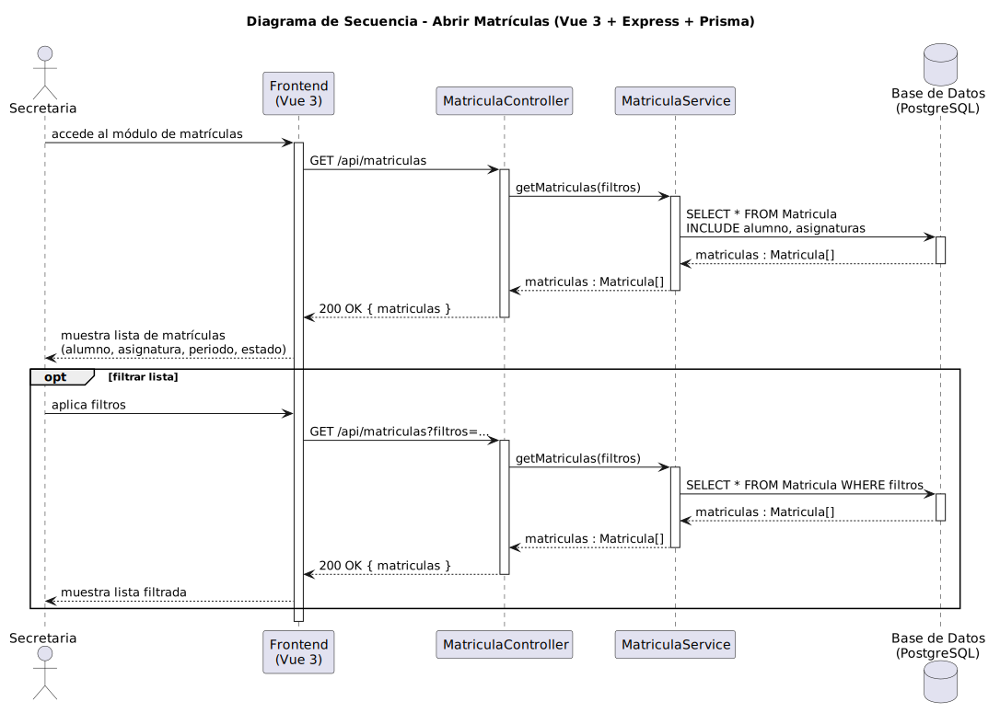

# CGU > abrirMatriculas > Diseño

> | [Inicio](../../../README.md) | [Requisitado](../../requisitado/README.md) | [Análisis](../../analisis/abrirMatriculas/README.md) | [Índice Diseño](../README.md) | **Diseño** | [Desarrollo](../../desarrollo/abrirMatriculas/README.md) |
> |---|---|---|---|---|---|

**Actor:** Secretaria

El Frontend (Vue 3) solicita el listado de matrículas al controlador Express, que las recupera de PostgreSQL mediante Prisma. Soporta filtrado mediante parámetros de query.

---

## Diagrama de secuencia

|  |
| :--- |
| [secuencia.puml](../../../modelosUML/diseño/abrirMatriculas/secuencia.puml) |

---

## Clases

| Clase | Tipo |
|-------|------|
| Frontend (Vue 3) | Vista |
| MatriculaController | Controlador |
| MatriculaService | Servicio |
| Base de Datos (PostgreSQL) | Base de Datos |
| Matricula | Modelo |

---

## Flujo de secuencia

1. La Secretaria accede al módulo de matrículas en el Frontend
2. Frontend → `GET /api/matriculas` → `MatriculaController.getMatriculas(filtros)`
3. `MatriculaService` consulta: `SELECT * FROM Matricula INCLUDE alumno, asignaturas`
4. Frontend muestra la lista de matrículas (alumno, asignatura, periodo, estado)
