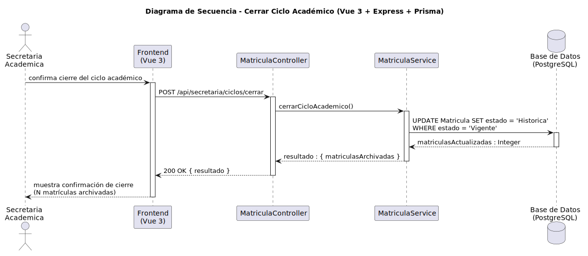

# CGU > cerrarCicloAcademico > Diseño

> | [Inicio](../../../README.md) | [Requisitado](../../requisitado/README.md) | [Análisis](../../analisis/cerrarCicloAcademico/README.md) | [Índice Diseño](../README.md) | **Diseño** |
> |---|---|---|---|---|

**Actor:** Secretaria

Permite a la Secretaria cerrar el ciclo académico activo, marcando todas las matrículas del ciclo como históricas en la base de datos (PostgreSQL). El Frontend (Vue 3) envía una petición al controlador (Express), el cual a través del servicio actualiza el estado de las matrículas.

---

## Diagrama de secuencia

|  |
| :--- |
| [secuencia.puml](../../../modelosUML/diseño/cerrarCicloAcademico/secuencia.puml) |

---

## Clases

| Clase | Tipo |
|-------|------|
| Frontend (Vue 3) | Vista |
| MatriculaController | Controlador |
| MatriculaService | Servicio |
| Base de Datos (PostgreSQL) | Base de Datos |
| Matricula | Modelo |

---

## Flujo de secuencia

1. La Secretaria Academica confirma cierre del ciclo académico en el Frontend (Vue 3).
2. El Frontend (Vue 3) realiza una petición HTTP POST a `/api/secretaria/ciclos/cerrar` al Controlador (`MatriculaController`).
3. El Controlador (`MatriculaController`) delega la lógica en el Servicio (`MatriculaService`) llamando a `cerrarCicloAcademico()`.
4. El Servicio (`MatriculaService`) realiza una consulta a la Base de Datos (PostgreSQL): `UPDATE Matricula SET estado = 'Historica' WHERE estado = 'Vigente'`.
5. La Base de Datos retorna el resultado `matriculasActualizadas : Integer` al Servicio (`MatriculaService`).
6. El MatriculaService retorna el resultado `resultado : { matriculasArchivadas }` al Controlador (`MatriculaController`).
7. El Controlador (`MatriculaController`) responde al Frontend (Vue 3) con un estado `200 OK` con los datos `{ resultado }`.
8. El Frontend (Vue 3) muestra confirmación de cierre (N matrículas archivadas) a la Secretaria Academica.
