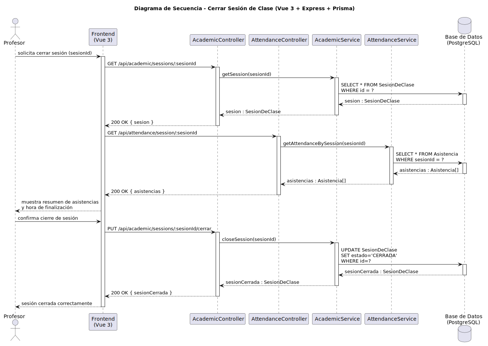

# CGU > cerrarSesionClase > Diseño

> | [Inicio](../../../README.md) | [Requisitado](../../requisitado/README.md) | [Análisis](../../analisis/cerrarSesionClase/README.md) | [Índice Diseño](../README.md) | **Diseño** |
> |---|---|---|---|---|

**Actor:** Profesor

---

## información del artefacto

| Campo | Valor |
|-------|-------|
| **Proyecto** | CGU - Centro de Gestión Universitaria |
| **Disciplina** | Análisis y Diseño |

---

## diagrama de secuencia

> fuente: [secuencia.puml](../../../modelosUML/diseño/cerrarSesionClase/secuencia.puml)

---

## clases de diseño identificadas

### frontend (Vue 3)

| Clase | Responsabilidad |
|-------|----------------|
| `ProfessorDashboard.vue` | Muestra el resumen de asistencias y la hora de finalización antes de confirmar el cierre |

### backend (Express + TypeScript)

| Clase | Responsabilidad |
|-------|----------------|
| `AcademicController` | Gestiona la carga de la sesión y la petición PUT de cierre |
| `AcademicService` | Recupera la sesión y actualiza su estado a `CERRADA` |
| `AttendanceController` | Gestiona la carga del listado de asistencias de la sesión |
| `AttendanceService` | Recupera las asistencias registradas para mostrar el resumen previo al cierre |

### base de datos (PostgreSQL)

| Tabla | Responsabilidad |
|-------|----------------|
| `SesionDeClase` | Actualiza el estado de la sesión a `CERRADA` |
| `Asistencia` | Proporciona el resumen de asistencias para mostrar al Profesor antes del cierre |

---

## flujo de secuencia

1. El Profesor solicita cerrar la sesión activa (sesionId).
2. El frontend llama `GET /api/academic/sessions/:sesionId` → `AcademicController` → `AcademicService.getSession(sesionId)` → `SELECT * FROM SesionDeClase WHERE id = ?` → devuelve `sesion`.
3. El frontend llama `GET /api/attendance/session/:sesionId` → `AttendanceController` → `AttendanceService.getAttendanceBySession(sesionId)` → `SELECT * FROM Asistencia WHERE sesionId = ?` → devuelve `Asistencia[]`.
4. El frontend muestra el resumen de asistencias y la hora de finalización.
5. El Profesor confirma el cierre de la sesión.
6. El frontend llama `PUT /api/academic/sessions/:sesionId/cerrar`.
7. `AcademicController` → `AcademicService.closeSession(sesionId)`.
8. `AcademicService` ejecuta `UPDATE SesionDeClase SET estado='CERRADA' WHERE id=?` → devuelve `sesionCerrada`.
9. `AcademicController` responde `200 OK { sesionCerrada }` → el frontend confirma el cierre e inicia `<<include>> exportarHistorialAsistencias(sesionId)`.

---

## referencias

- [Índice de diseño](../README.md)
- [Análisis de este caso](../../analisis/cerrarSesionClase/README.md)
- [Modelo del dominio](../../requisitado/00-modelo-del-dominio/README.md)
- [secuencia.puml](../../../modelosUML/diseño/cerrarSesionClase/secuencia.puml)
