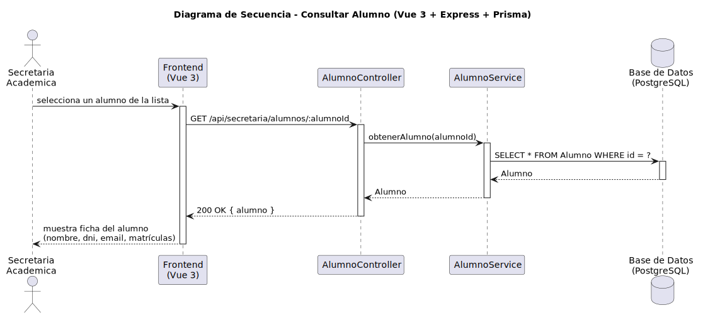

# CGU > consultarAlumno > Diseño

> | [Inicio](../../../README.md) | [Requisitado](../../requisitado/README.md) | [Análisis](../../analisis/consultarAlumno/README.md) | [Índice Diseño](../README.md) | **Diseño** |
> |---|---|---|---|---|

**Actor:** Secretaria

El Frontend (Vue 3) solicita la ficha de un alumno concreto al controlador Express, que la recupera de PostgreSQL mediante Prisma y la muestra en pantalla.

---

## Diagrama de secuencia

|  |
| :--- |
| [secuencia.puml](../../../modelosUML/diseño/consultarAlumno/secuencia.puml) |

---

## Clases

| Clase | Tipo |
|-------|------|
| Frontend (Vue 3) | Vista |
| AlumnoController | Controlador |
| AlumnoService | Servicio |
| Base de Datos (PostgreSQL) | Base de Datos |
| Alumno | Modelo |

---

## Flujo de secuencia

1. La Secretaria selecciona un alumno del listado en el Frontend
2. Frontend → `GET /api/secretaria/alumnos/:alumnoId` → `AlumnoController.getAlumno(alumnoId)`
3. `AlumnoService` consulta: `SELECT * FROM Alumno WHERE id = ?`
4. Frontend muestra la ficha del alumno (nombre, DNI, email, matrículas)
