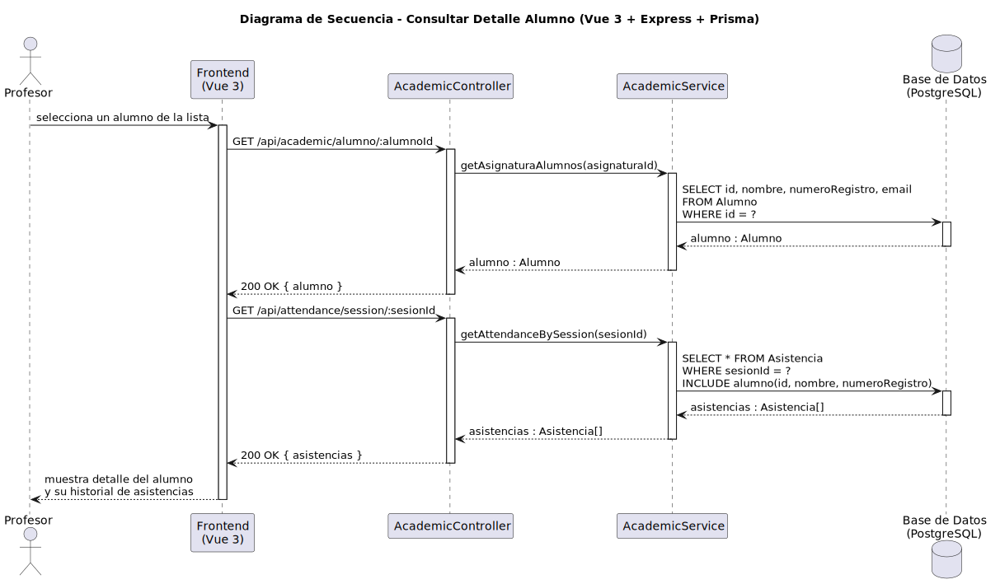

# CGU > consultarDetalleAlumno > Diseño

> | [Inicio](../../../README.md) | [Requisitado](../../requisitado/README.md) | [Análisis](../../analisis/consultarDetalleAlumno/README.md) | [Índice Diseño](../README.md) | **Diseño** | [Desarrollo](../../desarrollo/consultarDetalleAlumno/README.md) |
> |---|---|---|---|---|---|

**Actor:** Profesor

El Frontend (Vue 3) obtiene los datos personales del alumno y su historial de asistencia en dos llamadas al controlador Express, que las recupera de PostgreSQL mediante Prisma.

---

## Diagrama de secuencia

|  |
| :--- |
| [secuencia.puml](../../../modelosUML/diseño/consultarDetalleAlumno/secuencia.puml) |

---

## Clases

| Clase | Tipo |
|-------|------|
| Frontend (Vue 3) | Vista |
| AcademicController | Controlador |
| AcademicService | Servicio |
| Base de Datos (PostgreSQL) | Base de Datos |
| Alumno | Modelo |
| Asistencia | Modelo |

---

## Flujo de secuencia

1. El Profesor selecciona un alumno del listado en el Frontend
2. Frontend → `GET /api/academic/alumno/:alumnoId` → `AcademicController.getAlumno(alumnoId)`
3. `AcademicService` consulta: `SELECT id, nombre, numeroRegistro, email FROM Alumno WHERE id = ?`
4. Frontend → `GET /api/attendance/alumno/:alumnoId` → `AcademicController.getAttendanceByAlumno(alumnoId)`
5. `AcademicService` consulta: `SELECT * FROM Asistencia WHERE alumnoId = ? INCLUDE sesion`
6. Frontend muestra la ficha completa del alumno con estadísticas de asistencia
