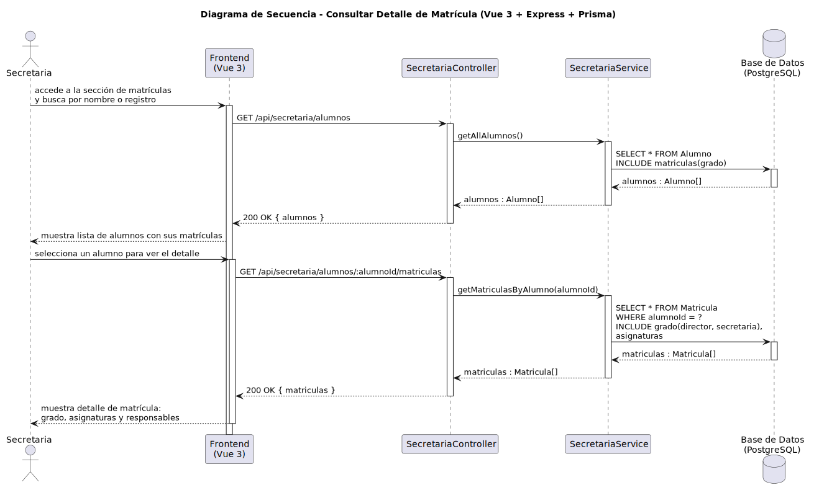

# CGU > consultarDetalleMatricula > Diseño

> | [Inicio](../../../README.md) | [Requisitado](../../requisitado/README.md) | [Análisis](../../analisis/consultarDetalleMatricula/README.md) | [Índice Diseño](../README.md) | **Diseño** |
> |---|---|---|---|---|

**Actor:** Secretaria

---

## información del artefacto

| Campo | Valor |
|-------|-------|
| **Proyecto** | CGU - Centro de Gestión Universitaria |
| **Disciplina** | Análisis y Diseño |

---

## diagrama de secuencia

> fuente: [secuencia.puml](../../../modelosUML/diseño/consultarDetalleMatricula/secuencia.puml)

---

## clases de diseño identificadas

### frontend (Vue 3)

| Clase | Responsabilidad |
|-------|----------------|
| `SecretariaDashboard.vue` | Lista los alumnos del sistema y muestra el detalle de matrícula al seleccionar uno |

### backend (Express + TypeScript)

| Clase | Responsabilidad |
|-------|----------------|
| `SecretariaController` | Recibe las peticiones de listado de alumnos y de detalle de matrícula |
| `SecretariaService` | Recupera alumnos con sus matrículas incluidas; recupera el detalle de matrículas de un alumno concreto |

### base de datos (PostgreSQL)

| Tabla | Responsabilidad |
|-------|----------------|
| `Alumno` | Datos identificativos del alumno |
| `Matricula` | Asociación del alumno con su grado; incluye asignaturas y responsables del grado |
| `Grado` | Agrupa las asignaturas y referencia al director y secretaria responsables |

---

## flujo de secuencia

1. La Secretaria accede a la sección de alumnos en `SecretariaDashboard.vue`.
2. El frontend llama `GET /api/secretaria/alumnos` al `SecretariaController`.
3. `SecretariaService.getAllAlumnos()` ejecuta `SELECT * FROM Alumno INCLUDE matriculas(grado)`.
4. La base de datos devuelve `alumnos : Alumno[]`; el frontend muestra la lista con sus matrículas.
5. La Secretaria selecciona un alumno para ver el detalle de su matrícula.
6. El frontend llama `GET /api/secretaria/alumnos/:alumnoId/matriculas` al `SecretariaController`.
7. `SecretariaService.getMatriculasByAlumno(alumnoId)` ejecuta `SELECT * FROM Matricula WHERE alumnoId = ? INCLUDE grado(director, secretaria), asignaturas`.
8. La base de datos devuelve `matriculas : Matricula[]`; el frontend muestra el detalle con grado, asignaturas y responsables.

---

## referencias

- [Índice de diseño](../README.md)
- [Análisis de este caso](../../analisis/consultarDetalleMatricula/README.md)
- [Modelo del dominio](../../requisitado/00-modelo-del-dominio/README.md)
- [secuencia.puml](../../../modelosUML/diseño/consultarDetalleMatricula/secuencia.puml)
