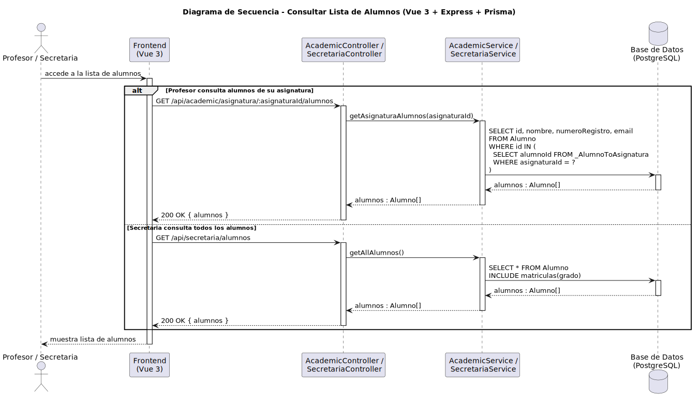

# CGU > consultarListaAlumnos > Diseño

> | [Inicio](../../../README.md) | [Requisitado](../../requisitado/README.md) | [Análisis](../../analisis/consultarListaAlumnos/README.md) | [Índice Diseño](../README.md) | **Diseño** |
> |---|---|---|---|---|

**Actores:** Profesor · SecretariaAcadémica

---

## información del artefacto

| Campo | Valor |
|-------|-------|
| **Proyecto** | CGU - Centro de Gestión Universitaria |
| **Disciplina** | Análisis y Diseño |

---

## diagrama de secuencia

> fuente: [secuencia.puml](../../../modelosUML/diseño/consultarListaAlumnos/secuencia.puml)

---

## clases de diseño identificadas

### frontend (Vue 3)

| Clase | Responsabilidad |
|-------|----------------|
| `ProfessorDashboard.vue` | Lista los alumnos de la asignatura activa del profesor |
| `SecretariaDashboard.vue` | Lista todos los alumnos del sistema con sus matrículas |

### backend (Express + TypeScript)

| Clase | Responsabilidad |
|-------|----------------|
| `AcademicController` | Gestiona la consulta de alumnos por asignatura (ruta del Profesor) |
| `AcademicService` | Recupera los alumnos inscritos en una asignatura concreta vía tabla m2m |
| `SecretariaController` | Gestiona la consulta de todos los alumnos (ruta de Secretaria) |
| `SecretariaService` | Recupera todos los alumnos con sus matrículas y grado incluidos |

### base de datos (PostgreSQL)

| Tabla | Responsabilidad |
|-------|----------------|
| `Alumno` | Datos de cada alumno (nombre, numeroRegistro, email) |
| `_AlumnoToAsignatura` | Tabla m2m que asocia alumnos con asignaturas (ruta Profesor) |
| `Matricula` | Asocia al alumno con su grado (ruta Secretaria) |

---

## flujo de secuencia

**Ruta Profesor:**

1. El Profesor accede a la lista de alumnos de su asignatura en `ProfessorDashboard.vue`.
2. El frontend llama `GET /api/academic/asignatura/:asignaturaId/alumnos` al `AcademicController`.
3. `AcademicService.getAsignaturaAlumnos(asignaturaId)` ejecuta `SELECT ... FROM Alumno WHERE id IN (SELECT alumnoId FROM _AlumnoToAsignatura WHERE asignaturaId = ?)`.
4. La base de datos devuelve `alumnos : Alumno[]`; el frontend muestra la lista.

**Ruta Secretaria:**

1. La Secretaria accede a la sección de alumnos en `SecretariaDashboard.vue`.
2. El frontend llama `GET /api/secretaria/alumnos` al `SecretariaController`.
3. `SecretariaService.getAllAlumnos()` ejecuta `SELECT * FROM Alumno INCLUDE matriculas(grado)`.
4. La base de datos devuelve `alumnos : Alumno[]` con sus matrículas; el frontend muestra la lista completa.

---

## referencias

- [Índice de diseño](../README.md)
- [Análisis de este caso](../../analisis/consultarListaAlumnos/README.md)
- [Modelo del dominio](../../requisitado/00-modelo-del-dominio/README.md)
- [secuencia.puml](../../../modelosUML/diseño/consultarListaAlumnos/secuencia.puml)
