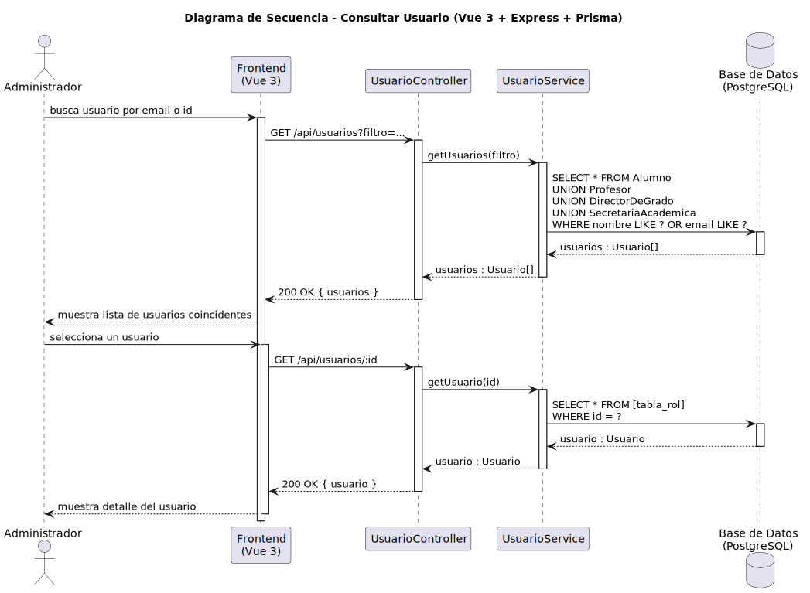

# CGU > consultarUsuario > Diseño

> | [Inicio](../../../README.md) | [Requisitado](../../requisitado/README.md) | [Análisis](../../analisis/consultarUsuario/README.md) | [Índice Diseño](../README.md) | **Diseño** | [Desarrollo](../../desarrollo/consultarUsuario/README.md) |
> |---|---|---|---|---|---|

**Actor:** Administrador

El Frontend (Vue 3) solicita la ficha de un usuario concreto al controlador Express, que la recupera de PostgreSQL mediante Prisma y la muestra en pantalla.

---

## Diagrama de secuencia

|  |
| :--- |
| [secuencia.puml](../../../modelosUML/diseño/consultarUsuario/secuencia.puml) |

---

## Clases

| Clase | Tipo |
|-------|------|
| Frontend (Vue 3) | Vista |
| UsuarioController | Controlador |
| UsuarioService | Servicio |
| Base de Datos (PostgreSQL) | Base de Datos |
| Usuario | Modelo |

---

## Flujo de secuencia

1. El Administrador selecciona un usuario del listado en el Frontend
2. Frontend → `GET /api/usuarios/:id` → `UsuarioController.getUsuario(id)`
3. `UsuarioService` consulta: `SELECT * FROM Usuario WHERE id = ?`
4. Frontend muestra el detalle del usuario (nombre, DNI, correo, rol, estado)
