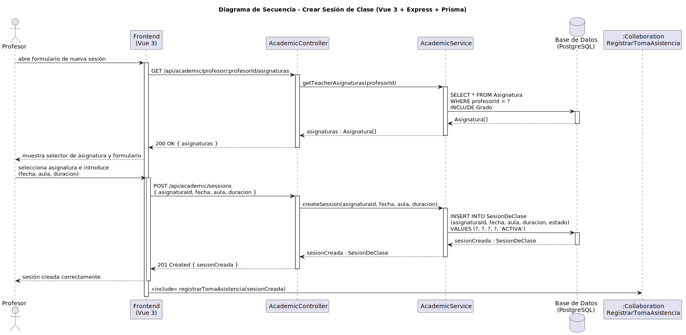

# CGU > crearSesionClase > Diseño

> | [Inicio](../../../README.md) | [Requisitado](../../requisitado/README.md) | [Análisis](../../analisis/crearSesionClase/README.md) | [Índice Diseño](../README.md) | **Diseño** |
> |---|---|---|---|---|

**Actor:** Profesor

---

## información del artefacto

| Campo | Valor |
|-------|-------|
| **Proyecto** | CGU - Centro de Gestión Universitaria |
| **Disciplina** | Análisis y Diseño |

---

## diagrama de secuencia

> fuente: [secuencia.puml](../../../modelosUML/diseño/crearSesionClase/secuencia.puml)

---

## clases de diseño identificadas

### frontend (Vue 3)

| Clase | Responsabilidad |
|-------|----------------|
| `ProfessorDashboard.vue` | Muestra el selector de asignatura y el formulario de sesión; envía los datos al backend |

### backend (Express + TypeScript)

| Clase | Responsabilidad |
|-------|----------------|
| `AcademicController` | Gestiona las peticiones HTTP de carga de asignaturas y creación de sesión |
| `AcademicService` | Recupera las asignaturas del profesor y ejecuta la creación de la sesión en la base de datos |

### base de datos (PostgreSQL)

| Tabla | Responsabilidad |
|-------|----------------|
| `Asignatura` | Proporciona las asignaturas asignadas al profesor para el selector del formulario |
| `SesionDeClase` | Almacena la nueva sesión con estado `ACTIVA`, asignaturaId, fecha, aula y duración |

---

## flujo de secuencia

1. El Profesor abre el formulario de nueva sesión en `ProfessorDashboard.vue`.
2. El frontend llama `GET /api/academic/profesor/:profesorId/asignaturas` → `AcademicController` → `AcademicService.getTeacherAsignaturas(profesorId)`.
3. `AcademicService` ejecuta `SELECT * FROM Asignatura WHERE profesorId = ?` → devuelve `Asignatura[]` al frontend.
4. El Profesor selecciona asignatura e introduce fecha, aula y duración.
5. El frontend llama `POST /api/academic/sessions { asignaturaId, fecha, aula, duracion }`.
6. `AcademicController` → `AcademicService.createSession(asignaturaId, fecha, aula, duracion)`.
7. `AcademicService` ejecuta `INSERT INTO SesionDeClase (..., estado) VALUES (..., 'ACTIVA')` → devuelve `sesionCreada`.
8. `AcademicController` responde `201 Created { sesionCreada }` al frontend.
9. El frontend confirma la creación e inicia `<<include>> registrarTomaAsistencia(sesionCreada)`.

---

## referencias

- [Índice de diseño](../README.md)
- [Análisis de este caso](../../analisis/crearSesionClase/README.md)
- [Modelo del dominio](../../requisitado/00-modelo-del-dominio/README.md)
- [secuencia.puml](../../../modelosUML/diseño/crearSesionClase/secuencia.puml)
