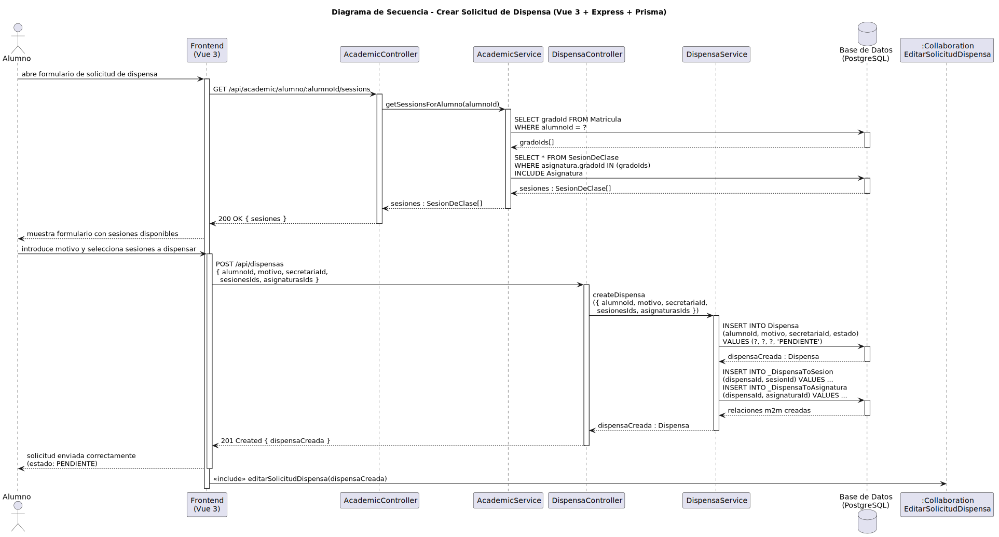

# CGU > crearSolicitudDispensa > Diseño

> | [Inicio](../../../README.md) | [Requisitado](../../requisitado/README.md) | [Análisis](../../analisis/crearSolicitudDispensa/README.md) | [Índice Diseño](../README.md) | **Diseño** |
> |---|---|---|---|---|

**Actores:** Alumno · SecretariaAcadémica

---

## información del artefacto

| Campo | Valor |
|-------|-------|
| **Proyecto** | CGU - Centro de Gestión Universitaria |
| **Disciplina** | Análisis y Diseño |

---

## diagrama de secuencia

> fuente: [secuencia.puml](../../../modelosUML/diseño/crearSolicitudDispensa/secuencia.puml)

---

## clases de diseño identificadas

### frontend (Vue 3)

| Clase | Responsabilidad |
|-------|----------------|
| `StudentDashboard.vue` | Muestra las sesiones disponibles, recoge el motivo y las sesiones a dispensar, y envía la solicitud |

### backend (Express + TypeScript)

| Clase | Responsabilidad |
|-------|----------------|
| `AcademicController` | Gestiona la carga de sesiones del alumno vía sus matrículas |
| `AcademicService` | Obtiene los grados del alumno y sus sesiones de clase asociadas |
| `DispensaController` | Recibe la petición de creación de dispensa y delega en el servicio |
| `DispensaService` | Crea la dispensa y establece las relaciones m2m con sesiones y asignaturas |

### base de datos (PostgreSQL)

| Tabla | Responsabilidad |
|-------|----------------|
| `Matricula` | Proporciona los gradoIds del alumno para localizar sus sesiones |
| `SesionDeClase` | Proporciona las sesiones disponibles para seleccionar en el formulario |
| `Dispensa` | Almacena la solicitud con estado `PENDIENTE`, alumnoId, motivo y secretariaId |
| `_DispensaToSesion` | Tabla intermedia m2m entre Dispensa y SesionDeClase |
| `_DispensaToAsignatura` | Tabla intermedia m2m entre Dispensa y Asignatura |

---

## flujo de secuencia

1. El Alumno abre el formulario de solicitud de dispensa en `StudentDashboard.vue`.
2. El frontend llama `GET /api/academic/alumno/:alumnoId/sessions` → `AcademicController` → `AcademicService.getSessionsForAlumno(alumnoId)`.
3. `AcademicService` consulta `SELECT gradoId FROM Matricula WHERE alumnoId = ?` y luego `SELECT * FROM SesionDeClase WHERE asignatura.gradoId IN (gradoIds)` → devuelve `sesiones[]`.
4. El Alumno introduce el motivo y selecciona las sesiones a dispensar.
5. El frontend llama `POST /api/dispensas { alumnoId, motivo, secretariaId, sesionesIds, asignaturasIds }`.
6. `DispensaController` → `DispensaService.createDispensa({ alumnoId, motivo, secretariaId, sesionesIds, asignaturasIds })`.
7. `DispensaService` ejecuta `INSERT INTO Dispensa (..., estado) VALUES (..., 'PENDIENTE')`.
8. `DispensaService` inserta las relaciones m2m en `_DispensaToSesion` y `_DispensaToAsignatura`.
9. `DispensaController` responde `201 Created { dispensaCreada }` al frontend.
10. El frontend confirma el envío e inicia `<<include>> editarSolicitudDispensa(dispensaCreada)`.

---

## referencias

- [Índice de diseño](../README.md)
- [Análisis de este caso](../../analisis/crearSolicitudDispensa/README.md)
- [Modelo del dominio](../../requisitado/00-modelo-del-dominio/README.md)
- [secuencia.puml](../../../modelosUML/diseño/crearSolicitudDispensa/secuencia.puml)
