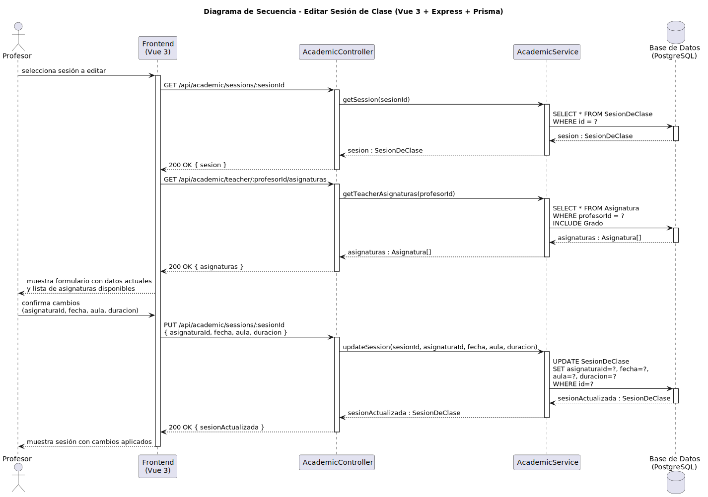

# CGU > editarSesionClase > Diseño

> | [Inicio](../../../README.md) | [Requisitado](../../requisitado/README.md) | [Análisis](../../analisis/editarSesionClase/README.md) | [Índice Diseño](../README.md) | **Diseño** |
> |---|---|---|---|---|

**Actor:** Profesor

---

## información del artefacto

| Campo | Valor |
|-------|-------|
| **Proyecto** | CGU - Centro de Gestión Universitaria |
| **Disciplina** | Análisis y Diseño |

---

## diagrama de secuencia

> fuente: [secuencia.puml](../../../modelosUML/diseño/editarSesionClase/secuencia.puml)

---

## clases de diseño identificadas

### frontend (Vue 3)

| Clase | Responsabilidad |
|-------|----------------|
| `ProfessorDashboard.vue` | Muestra el formulario de edición con los datos actuales de la sesión y la lista de asignaturas disponibles |

### backend (Express + TypeScript)

| Clase | Responsabilidad |
|-------|----------------|
| `AcademicController` | Gestiona las peticiones GET de carga de sesión y asignaturas, y la PUT de actualización |
| `AcademicService` | Recupera la sesión y las asignaturas del profesor, y persiste los cambios en la base de datos |

### base de datos (PostgreSQL)

| Tabla | Responsabilidad |
|-------|----------------|
| `SesionDeClase` | Fuente y destino de los datos editados (asignaturaId, fecha, aula, duración) |
| `Asignatura` | Proporciona las asignaturas del profesor para el selector del formulario |

---

## flujo de secuencia

1. El Profesor selecciona la sesión que desea editar.
2. El frontend llama `GET /api/academic/sessions/:sesionId` → `AcademicController` → `AcademicService.getSession(sesionId)`.
3. `AcademicService` ejecuta `SELECT * FROM SesionDeClase WHERE id = ?` → devuelve `sesion` al frontend.
4. El frontend llama `GET /api/academic/teacher/:profesorId/asignaturas` → `AcademicService.getTeacherAsignaturas(profesorId)`.
5. `AcademicService` ejecuta `SELECT * FROM Asignatura WHERE profesorId = ? INCLUDE Grado` → devuelve `Asignatura[]`.
6. El frontend muestra el formulario con los datos actuales y la lista de asignaturas disponibles.
7. El Profesor introduce las modificaciones (asignaturaId, fecha, aula, duracion) y confirma.
8. El frontend llama `PUT /api/academic/sessions/:sesionId { asignaturaId, fecha, aula, duracion }`.
9. `AcademicController` → `AcademicService.updateSession(sesionId, asignaturaId, fecha, aula, duracion)`.
10. `AcademicService` ejecuta `UPDATE SesionDeClase SET asignaturaId=?, fecha=?, aula=?, duracion=? WHERE id=?` → devuelve `sesionActualizada`.
11. `AcademicController` responde `200 OK { sesionActualizada }` → el frontend muestra la sesión con los cambios aplicados.

---

## referencias

- [Índice de diseño](../README.md)
- [Análisis de este caso](../../analisis/editarSesionClase/README.md)
- [Modelo del dominio](../../requisitado/00-modelo-del-dominio/README.md)
- [secuencia.puml](../../../modelosUML/diseño/editarSesionClase/secuencia.puml)
