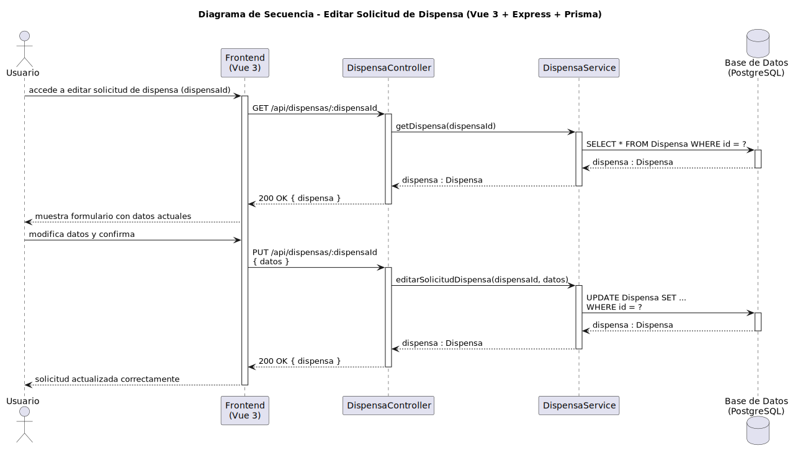

# CGU > editarSolicitudDispensa > Diseño

> | [Inicio](../../../README.md) | [Requisitado](../../requisitado/README.md) | [Análisis](../../analisis/editarSolicitudDispensa/README.md) | [Índice Diseño](../README.md) | **Diseño** |
> |---|---|---|---|---|

**Actor:** Alumno · DirectorDeGrado · Secretaria

El Frontend (Vue 3) precarga los datos actuales de la dispensa desde Express y envía los cambios para que el servicio actualice el registro o el estado de resolución en PostgreSQL.

---

## Diagrama de secuencia

|  |
| :--- |
| [secuencia.puml](../../../modelosUML/diseño/editarSolicitudDispensa/secuencia.puml) |

---

## Clases

| Clase | Tipo |
|-------|------|
| Frontend (Vue 3) | Vista |
| DispensaController | Controlador |
| DispensaService | Servicio |
| Base de Datos (PostgreSQL) | Base de Datos |
| Dispensa | Modelo |

---

## Flujo de secuencia

1. El actor selecciona la dispensa a editar en el Frontend
2. Frontend → `GET /api/dispensas/:dispensaId` → `DispensaController.getDispensa(dispensaId)`
3. `DispensaService` consulta: `SELECT * FROM Dispensa WHERE id = ?`
4. Frontend muestra el formulario precargado con los datos actuales
5. El actor modifica los campos y confirma
6. Frontend → `PUT /api/dispensas/:dispensaId { datos }` → `DispensaController.editarSolicitudDispensa(dispensaId, datos)`
7. `DispensaService` ejecuta: `UPDATE Dispensa SET ... WHERE id = ?`
8. Frontend muestra confirmación "solicitud actualizada correctamente"
