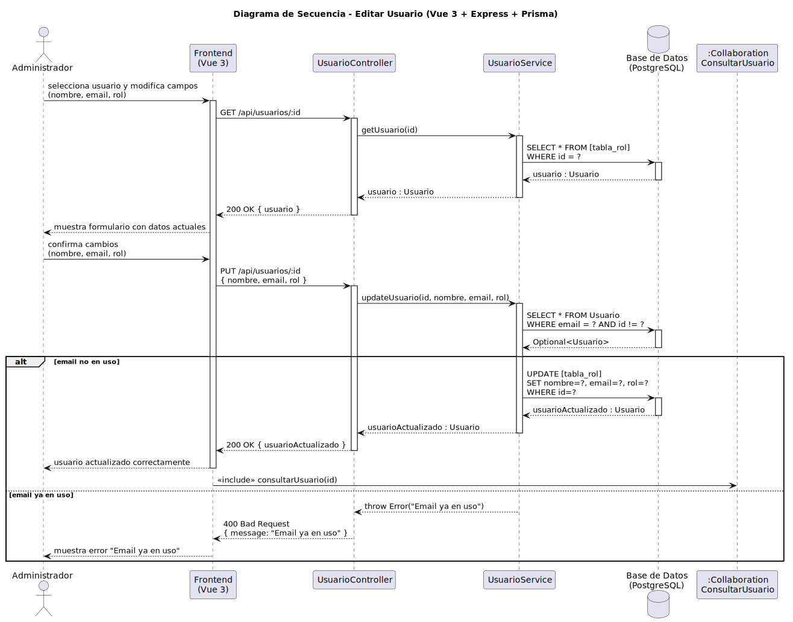

# CGU > editarUsuario > Diseño

> | [Inicio](../../../README.md) | [Requisitado](../../requisitado/README.md) | [Análisis](../../analisis/editarUsuario/README.md) | [Índice Diseño](../README.md) | **Diseño** |
> |---|---|---|---|---|

**Actor:** Administrador

---

## información del artefacto

| Campo | Valor |
|-------|-------|
| **Proyecto** | CGU - Centro de Gestión Universitaria |
| **Disciplina** | Análisis y Diseño |

---

## diagrama de secuencia

> fuente: [secuencia.puml](../../../modelosUML/diseño/editarUsuario/secuencia.puml)

---

## clases de diseño identificadas

### frontend (Vue 3)

| Clase | Responsabilidad |
|-------|----------------|
| `AdminDashboard.vue` | Presenta el formulario de edición con los datos actuales del usuario y gestiona la respuesta del servidor |

### backend (Express + TypeScript)

| Clase | Responsabilidad |
|-------|----------------|
| `UsuarioController` | Recibe las peticiones GET y PUT y delega en el servicio |
| `UsuarioService` | Recupera el usuario por id, verifica la unicidad del email y persiste los cambios |

### base de datos (PostgreSQL)

| Tabla | Responsabilidad |
|-------|----------------|
| `[tabla_rol]` | Tabla correspondiente al rol del usuario (Alumno, Profesor, etc.); fuente y destino de los datos editados |

---

## flujo de secuencia

1. El Administrador selecciona un usuario y abre el formulario de edición.
2. El frontend llama `GET /api/usuarios/:id` → `UsuarioController` → `UsuarioService.getUsuario(id)`.
3. `UsuarioService` ejecuta `SELECT * FROM [tabla_rol] WHERE id = ?` → devuelve `usuario` al frontend.
4. El frontend muestra el formulario con los datos actuales (nombre, email, rol).
5. El Administrador modifica los campos y confirma los cambios.
6. El frontend llama `PUT /api/usuarios/:id { nombre, email, rol }`.
7. `UsuarioController` → `UsuarioService.updateUsuario(id, nombre, email, rol)`.
8. `UsuarioService` consulta `SELECT WHERE email = ? AND id != ?` para verificar unicidad del email.
9. **[Email no en uso]** ejecuta `UPDATE [tabla_rol] SET nombre=?, email=?, rol=? WHERE id=?` → devuelve `usuarioActualizado` → `200 OK` → el frontend confirma e inicia `<<include>> consultarUsuario(id)`.
10. **[Email ya en uso]** el servicio lanza error → `400 Bad Request` → el frontend muestra "Email ya en uso".

---

## referencias

- [Índice de diseño](../README.md)
- [Análisis de este caso](../../analisis/editarUsuario/README.md)
- [Modelo del dominio](../../requisitado/00-modelo-del-dominio/README.md)
- [secuencia.puml](../../../modelosUML/diseño/editarUsuario/secuencia.puml)
