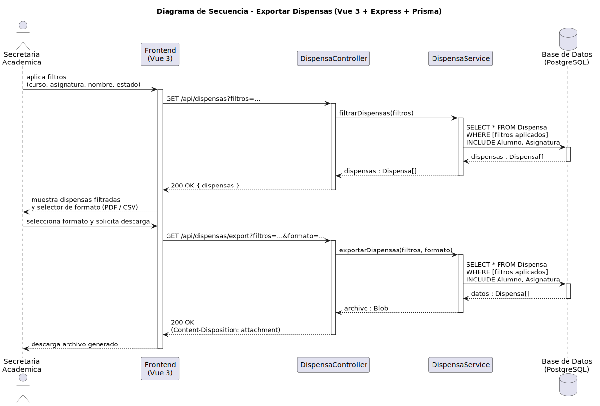

# CGU > exportarDispensas > Diseño

> | [Inicio](../../../README.md) | [Requisitado](../../requisitado/README.md) | [Análisis](../../analisis/exportarDispensas/README.md) | [Índice Diseño](../README.md) | **Diseño** |
> |---|---|---|---|---|

**Actor:** SecretariaAcademica

---

## información del artefacto

| Campo | Valor |
|-------|-------|
| **Proyecto** | CGU - Centro de Gestión Universitaria |
| **Disciplina** | Análisis y Diseño |

---

## diagrama de secuencia

> fuente: [secuencia.puml](../../../modelosUML/diseño/exportarDispensas/secuencia.puml)

---

## clases de diseño identificadas

### frontend (Vue 3)

| Clase | Responsabilidad |
|-------|----------------|
| `SecretariaDashboard.vue` | Presenta el panel de filtros, el listado de dispensas resultante y el selector de formato de exportación |

### backend (Express + TypeScript)

| Clase | Responsabilidad |
|-------|----------------|
| `DispensaController` | Gestiona la petición de filtrado y la generación del archivo de exportación |
| `DispensaService` | Ejecuta la consulta con filtros aplicados y genera el archivo en el formato solicitado |

### base de datos (PostgreSQL)

| Tabla | Responsabilidad |
|-------|----------------|
| `Dispensa` | Fuente principal de los datos exportados (motivo, estado, fechas) |
| `Alumno` | Incluida en la consulta para añadir datos del alumno al informe |
| `Asignatura` | Incluida en la consulta para añadir datos de la asignatura al informe |

---

## flujo de secuencia

1. La Secretaria aplica filtros (curso, asignatura, nombre, estado).
2. El frontend llama `GET /api/dispensas?filtros=...` → `DispensaController` → `DispensaService.filtrarDispensas(filtros)`.
3. `DispensaService` ejecuta `SELECT * FROM Dispensa WHERE [filtros] INCLUDE Alumno, Asignatura` → devuelve `Dispensa[]`.
4. `DispensaController` responde `200 OK { dispensas }` → el frontend muestra el listado filtrado.
5. La Secretaria selecciona el formato de exportación (PDF / CSV) y solicita la descarga.
6. El frontend llama `GET /api/dispensas/export?filtros=...&formato=...`.
7. `DispensaController` → `DispensaService.exportarDispensas(filtros, formato)`.
8. `DispensaService` ejecuta de nuevo la consulta con filtros e incluye datos de Alumno y Asignatura → genera el archivo en el formato solicitado.
9. `DispensaController` responde `200 OK` con cabecera `Content-Disposition: attachment` → el frontend inicia la descarga del archivo.

---

## referencias

- [Índice de diseño](../README.md)
- [Análisis de este caso](../../analisis/exportarDispensas/README.md)
- [Modelo del dominio](../../requisitado/00-modelo-del-dominio/README.md)
- [secuencia.puml](../../../modelosUML/diseño/exportarDispensas/secuencia.puml)
