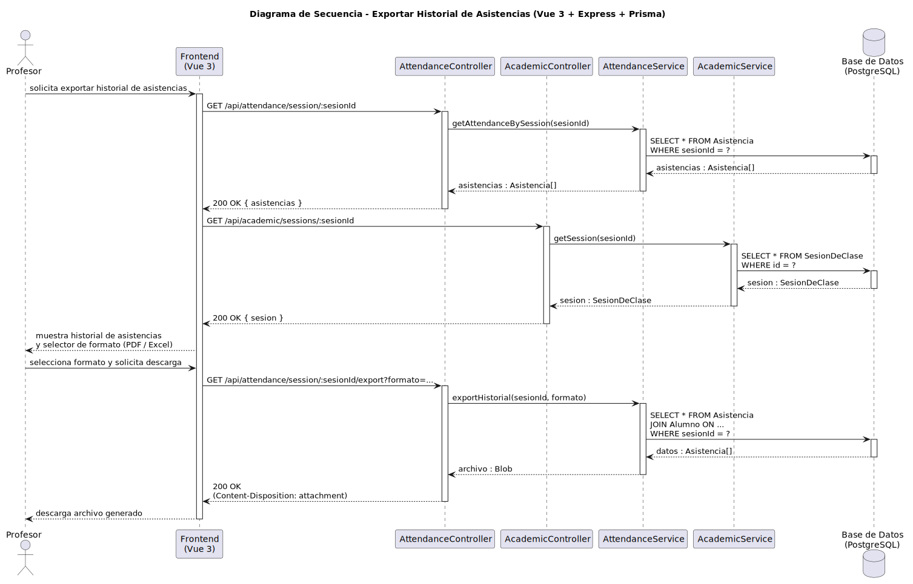

# CGU > exportarHistorialAsistencias > Diseño

> | [Inicio](../../../README.md) | [Requisitado](../../requisitado/README.md) | [Análisis](../../analisis/exportarHistorialAsistencias/README.md) | [Índice Diseño](../README.md) | **Diseño** |
> |---|---|---|---|---|

**Actor:** Profesor

El Frontend (Vue 3) obtiene las asistencias del periodo seleccionado y solicita al controlador Express que genere y devuelva el archivo en el formato elegido (Excel o PDF).

---

## Diagrama de secuencia

|  |
| :--- |
| [secuencia.puml](../../../modelosUML/diseño/exportarHistorialAsistencias/secuencia.puml) |

---

## Clases

| Clase | Tipo |
|-------|------|
| Frontend (Vue 3) | Vista |
| AttendanceController | Controlador |
| AttendanceService | Servicio |
| Base de Datos (PostgreSQL) | Base de Datos |
| Asistencia | Modelo |

---

## Flujo de secuencia

1. El Profesor configura los parámetros de exportación (asignatura, rango de fechas, formato) en el Frontend
2. Frontend → `GET /api/attendance/asignatura/:asignaturaId?desde=&hasta=` → `AttendanceController.getAttendanceByAsignatura(asignaturaId, desde, hasta)`
3. `AttendanceService` consulta: `SELECT * FROM Asistencia WHERE asignaturaId = ? AND fecha BETWEEN ? AND ?`
4. Frontend muestra el historial de asistencias y el Profesor confirma la descarga
5. Frontend → `GET /api/attendance/asignatura/:asignaturaId/export?formato=...` → `AttendanceController.exportHistorial(asignaturaId, desde, hasta, formato)`
6. `AttendanceService` genera el archivo (Excel / PDF) con los datos consultados
7. Frontend descarga el archivo (`Content-Disposition: attachment`)
