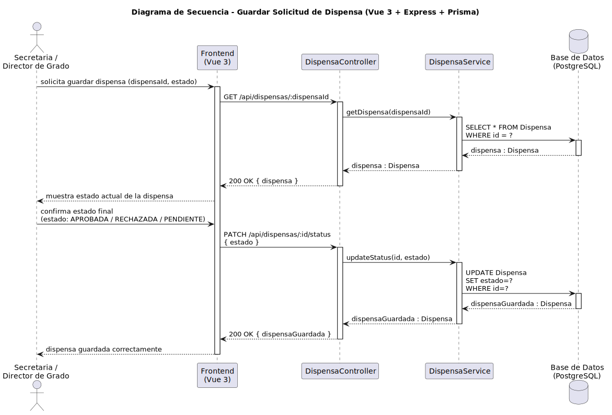

# CGU > guardarSolicitudDispensa > Diseño

> | [Inicio](../../../README.md) | [Requisitado](../../requisitado/README.md) | [Análisis](../../analisis/guardarSolicitudDispensa/README.md) | [Índice Diseño](../README.md) | **Diseño** |
> |---|---|---|---|---|

**Actores:** SecretariaAcademica · DirectorDeGrado

---

## información del artefacto

| Campo | Valor |
|-------|-------|
| **Proyecto** | CGU - Centro de Gestión Universitaria |
| **Disciplina** | Análisis y Diseño |

---

## diagrama de secuencia

> fuente: [secuencia.puml](../../../modelosUML/diseño/guardarSolicitudDispensa/secuencia.puml)

---

## clases de diseño identificadas

### frontend (Vue 3)

| Clase | Responsabilidad |
|-------|----------------|
| `SecretariaDashboard.vue / DirectorDashboard.vue` | Muestra el estado actual de la dispensa y permite confirmar el estado final |

### backend (Express + TypeScript)

| Clase | Responsabilidad |
|-------|----------------|
| `DispensaController` | Gestiona la petición GET de carga y la PATCH de actualización de estado |
| `DispensaService` | Recupera la dispensa por id y persiste el nuevo estado |

### base de datos (PostgreSQL)

| Tabla | Responsabilidad |
|-------|----------------|
| `Dispensa` | Almacena el estado final de la solicitud (APROBADA / RECHAZADA / PENDIENTE) |

---

## flujo de secuencia

1. La Secretaria o el Director solicita guardar la dispensa (dispensaId, estado).
2. El frontend llama `GET /api/dispensas/:dispensaId` → `DispensaController` → `DispensaService.getDispensa(dispensaId)`.
3. `DispensaService` ejecuta `SELECT * FROM Dispensa WHERE id = ?` → devuelve `dispensa` al frontend.
4. El frontend muestra el estado actual de la dispensa.
5. El actor confirma el estado final (APROBADA / RECHAZADA / PENDIENTE).
6. El frontend llama `PATCH /api/dispensas/:id/status { estado }`.
7. `DispensaController` → `DispensaService.updateStatus(id, estado)`.
8. `DispensaService` ejecuta `UPDATE Dispensa SET estado=? WHERE id=?` → devuelve `dispensaGuardada`.
9. `DispensaController` responde `200 OK { dispensaGuardada }` → el frontend confirma que la dispensa ha sido guardada correctamente.

---

## referencias

- [Índice de diseño](../README.md)
- [Análisis de este caso](../../analisis/guardarSolicitudDispensa/README.md)
- [Modelo del dominio](../../requisitado/00-modelo-del-dominio/README.md)
- [secuencia.puml](../../../modelosUML/diseño/guardarSolicitudDispensa/secuencia.puml)
