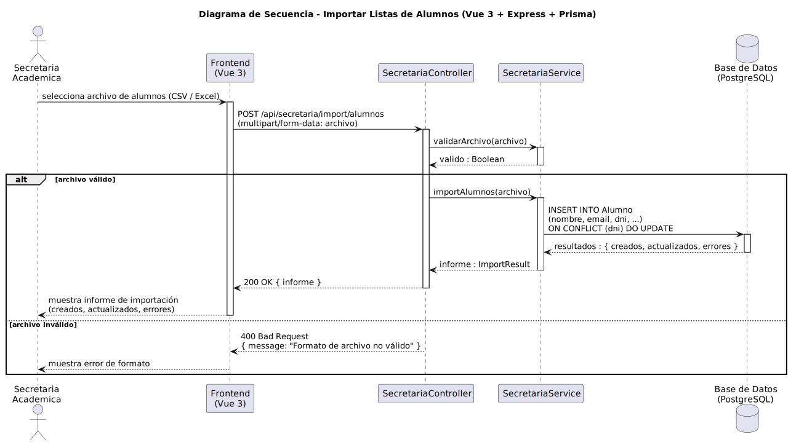

# CGU > importarListasAlumnos > Diseño

> | [Inicio](../../../README.md) | [Requisitado](../../requisitado/README.md) | [Análisis](../../analisis/importarListasAlumnos/README.md) | [Índice Diseño](../README.md) | **Diseño** |
> |---|---|---|---|---|

**Actor:** SecretariaAcademica

---

## información del artefacto

| Campo | Valor |
|-------|-------|
| **Proyecto** | CGU - Centro de Gestión Universitaria |
| **Disciplina** | Análisis y Diseño |

---

## diagrama de secuencia

> fuente: [secuencia.puml](../../../modelosUML/diseño/importarListasAlumnos/secuencia.puml)

---

## clases de diseño identificadas

### frontend (Vue 3)

| Clase | Responsabilidad |
|-------|----------------|
| `SecretariaDashboard.vue` | Presenta el selector de archivo y muestra el informe de resultados tras la importación |

### backend (Express + TypeScript)

| Clase | Responsabilidad |
|-------|----------------|
| `SecretariaController` | Recibe el archivo en formato `multipart/form-data` y delega la validación e importación en el servicio |
| `SecretariaService` | Valida el formato del archivo, procesa cada fila con `INSERT ... ON CONFLICT DO UPDATE` y devuelve el informe de resultados |

### base de datos (PostgreSQL)

| Tabla | Responsabilidad |
|-------|----------------|
| `Alumno` | Destino de los datos importados; la clave de unicidad es el DNI del alumno |

---

## flujo de secuencia

1. La Secretaria selecciona el archivo de alumnos (CSV / Excel).
2. El frontend llama `POST /api/secretaria/import/alumnos` con el archivo en `multipart/form-data`.
3. `SecretariaController` → `SecretariaService.validarArchivo(archivo)` → devuelve `valido : Boolean`.
4. **[Archivo válido]** `SecretariaController` → `SecretariaService.importAlumnos(archivo)`.
5. `SecretariaService` ejecuta por cada fila `INSERT INTO Alumno (nombre, email, dni, ...) ON CONFLICT (dni) DO UPDATE` → acumula resultados.
6. `SecretariaService` devuelve `informe : { creados, actualizados, errores }`.
7. `SecretariaController` responde `200 OK { informe }` → el frontend muestra el informe de importación.
8. **[Archivo inválido]** `SecretariaController` responde `400 Bad Request { message: "Formato de archivo no válido" }` → el frontend muestra el error.

---

## referencias

- [Índice de diseño](../README.md)
- [Análisis de este caso](../../analisis/importarListasAlumnos/README.md)
- [Modelo del dominio](../../requisitado/00-modelo-del-dominio/README.md)
- [secuencia.puml](../../../modelosUML/diseño/importarListasAlumnos/secuencia.puml)
