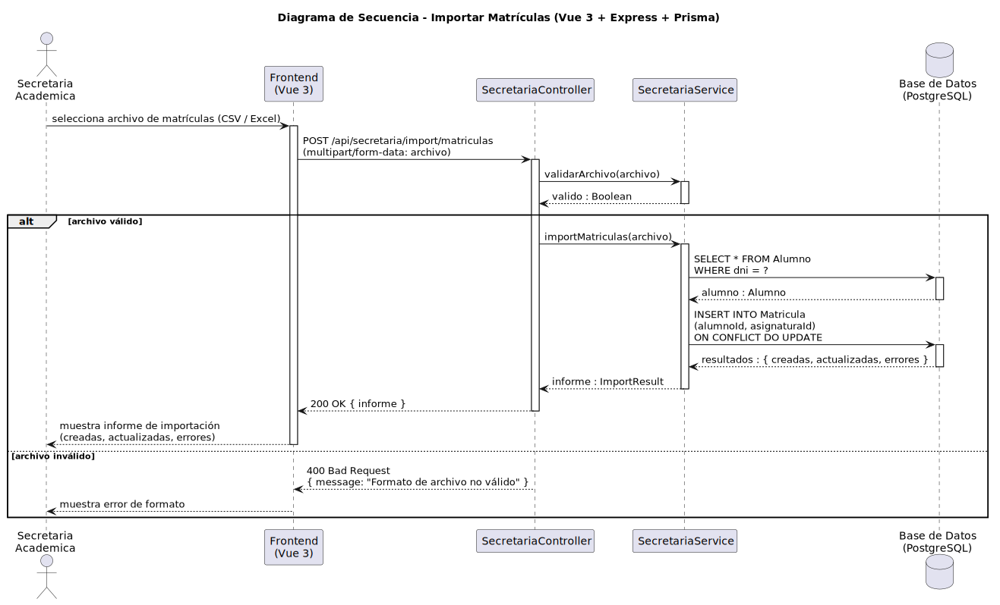

# CGU > importarMatriculas > Diseño

> | [Inicio](../../../README.md) | [Requisitado](../../requisitado/README.md) | [Análisis](../../analisis/importarMatriculas/README.md) | [Índice Diseño](../README.md) | **Diseño** |
> |---|---|---|---|---|

**Actor:** Secretaria

El Frontend (Vue 3) sube el archivo al controlador Express como `multipart/form-data`. El servicio valida el formato, localiza al alumno por DNI y crea o actualiza cada matrícula en PostgreSQL.

---

## Diagrama de secuencia

|  |
| :--- |
| [secuencia.puml](../../../modelosUML/diseño/importarMatriculas/secuencia.puml) |

---

## Clases

| Clase | Tipo |
|-------|------|
| Frontend (Vue 3) | Vista |
| SecretariaController | Controlador |
| SecretariaService | Servicio |
| Base de Datos (PostgreSQL) | Base de Datos |
| Alumno | Modelo |
| Matricula | Modelo |

---

## Flujo de secuencia

1. La Secretaria selecciona el archivo (CSV / Excel) en el Frontend
2. Frontend → `POST /api/secretaria/import/matriculas (multipart/form-data)` → `SecretariaController.importarMatriculas(archivo)`
3. `SecretariaService` valida el formato del archivo
4. Si el archivo es válido → por cada fila: `SELECT * FROM Alumno WHERE dni = ?` → `INSERT INTO Matricula (...) ON CONFLICT DO UPDATE` → Frontend muestra informe (creadas, actualizadas, errores)
5. Si el archivo no es válido → Frontend muestra error "Formato de archivo no válido" con `400 Bad Request`
