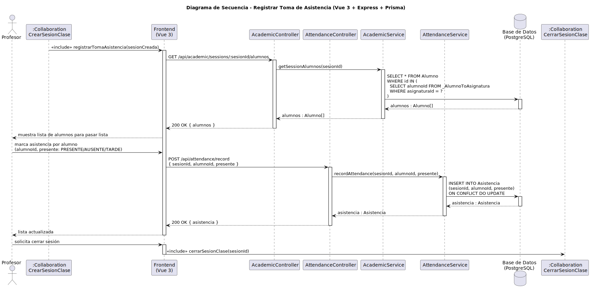

# CGU > registrarTomaAsistencia > Diseño

> | [Inicio](../../../README.md) | [Requisitado](../../requisitado/README.md) | [Análisis](../../analisis/registrarTomaAsistencia/README.md) | [Índice Diseño](../README.md) | **Diseño** |
> |---|---|---|---|---|

**Actor:** Profesor

Permite al Profesor pasar lista en una sesión activa. El Frontend (Vue 3) obtiene los alumnos matriculados desde el controlador (Express) y envía las marcas de asistencia para que el servicio las registre en la base de datos (PostgreSQL).

---

## Diagrama de secuencia

|  |
| :--- |
| [secuencia.puml](../../../modelosUML/diseño/registrarTomaAsistencia/secuencia.puml) |

---

## Clases

| Clase | Tipo |
|-------|------|
| Frontend (Vue 3) | Vista |
| AcademicController | Controlador |
| AttendanceController | Controlador |
| AcademicService | Servicio |
| AttendanceService | Servicio |
| Base de Datos (PostgreSQL) | Base de Datos |
| Alumno | Modelo |
| Asistencia | Modelo |

---

## Flujo de secuencia

1. El Profesor accede a registrar asistencia en sesión abierta en el Frontend (Vue 3).
2. El Frontend (Vue 3) realiza una petición HTTP GET a `/api/academic/sessions/:sesionId/alumnos` al Controlador (`AcademicController`).
3. El Controlador (`AcademicController`) delega la lógica en el Servicio (`AcademicService`) llamando a `getSessionAlumnos(sesionId)`.
4. El Servicio (`AcademicService`) realiza una consulta a la Base de Datos (PostgreSQL): `SELECT * FROM Alumno WHERE id IN (   SELECT alumnoId FROM _AlumnoToAsignatura   WHERE asignaturaId = ? )`.
5. La Base de Datos retorna el resultado `alumnos : Alumno[]` al Servicio (`AcademicService`).
6. El AcademicService retorna el resultado `alumnos : Alumno[]` al Controlador (`AcademicController`).
7. El Controlador (`AcademicController`) responde al Frontend (Vue 3) con un estado `200 OK` con los datos `{ alumnos }`.
8. El Frontend (Vue 3) muestra lista de alumnos para pasar lista al Profesor.
9. El Profesor marca asistencia por alumno (alumnoId, presente: PRESENTE/AUSENTE/TARDE) en el Frontend (Vue 3).
10. El Frontend (Vue 3) realiza una petición HTTP POST a `/api/attendance/record { sesionId, alumnoId, presente }` al Controlador (`AttendanceController`).
11. El Controlador (`AttendanceController`) delega la lógica en el Servicio (`AttendanceService`) llamando a `recordAttendance(sesionId, alumnoId, presente)`.
12. El Servicio (`AttendanceService`) realiza una consulta a la Base de Datos (PostgreSQL): `INSERT INTO Asistencia (sesionId, alumnoId, presente) ON CONFLICT DO UPDATE`.
13. La Base de Datos retorna el resultado `asistencia : Asistencia` al Servicio (`AttendanceService`).
14. El AttendanceService retorna el resultado `asistencia : Asistencia` al Controlador (`AttendanceController`).
15. El Controlador (`AttendanceController`) responde al Frontend (Vue 3) con un estado `200 OK` con los datos `{ asistencia }`.
16. El Frontend (Vue 3) muestra el mensaje "lista actualizada" al Profesor.
