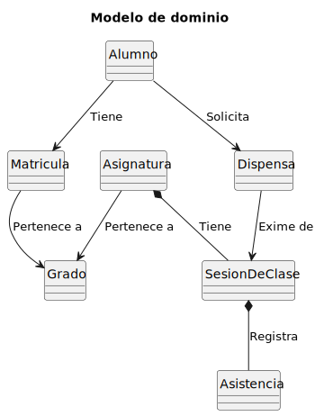
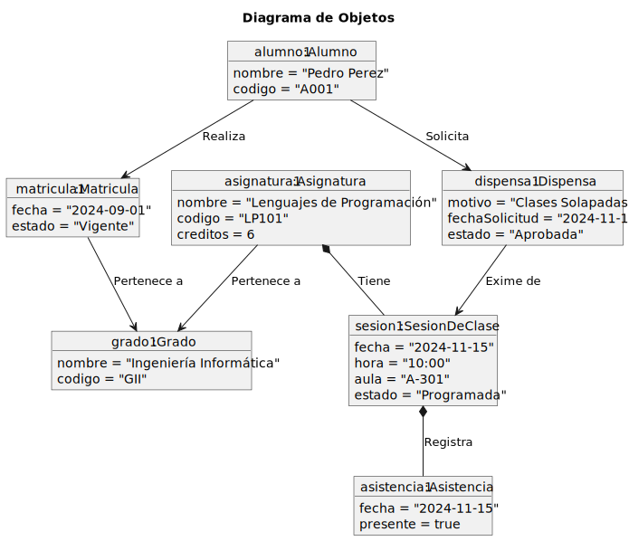
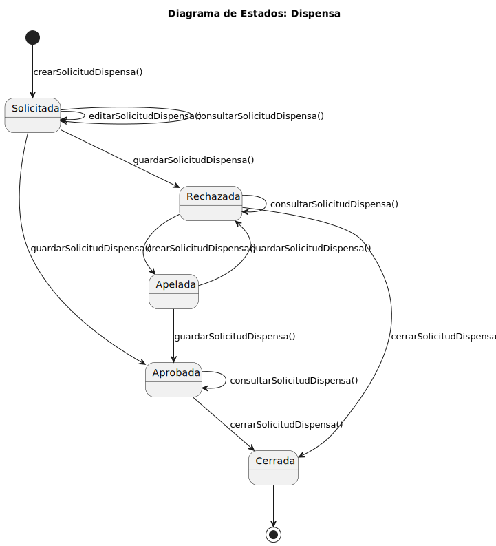

# Modelo del Dominio

> | [Inicio](../../../README.md) | [Requisitado](../README.md) | **Modelo del Dominio** | [Actores y CUs](../01-actores-casos-uso/README.md) | [Detallado CUs](../02-detalle/README.md) |
> |---|---|---|---|---|

---

## Diagrama de Clases

|  |
| :--- |
| [Código UML](DiagramaDeClases.puml) |

---

## Diagrama de Objetos

|  |
| :--- |
| [Código UML](DiagramaDeObjetos.puml) |

---

## Diagramas de Estado

### Estado: Alumno

|  |
| :--- |
| [Código UML](estado-Alumno.puml) |

### Estado: Asistencia

|  |
| :--- |
| [Código UML](estado-Asistencia.puml) |

### Estado: Dispensas

|  |
| :--- |
| [Código UML](estado-Dispensas.puml) |

### Estado: Matrícula

|  |
| :--- |
| [Código UML](estado-Matricula.puml) |
