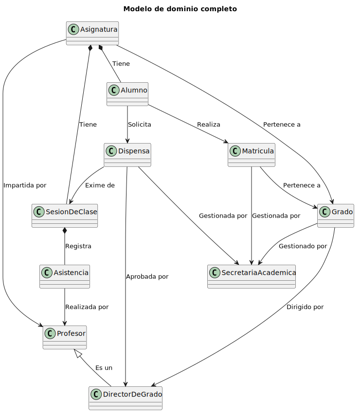

# CGU -- Modelo del Dominio

> | [Inicio](../../../README.md) | [Requisitado](../README.md) | **Modelo del Dominio** |
> |---|---|---|

---

## Diagrama de clases completo

[Fuente PUML](ModeloCompleto.puml)

---

## Diagrama de objetos

[Fuente PUML](DiagramaDeObjetos.puml)

---

## Diagramas de estado

| Entidad | Diagrama | PUML |
|---------|----------|------|
| Alumno |  | [estado-Alumno.puml](estado-Alumno.puml) |
| Asistencia |  | [estado-Asistencia.puml](estado-Asistencia.puml) |
| Dispensas |  | [estado-Dispensas.puml](estado-Dispensas.puml) |
| Matricula |  | [estado-Matricula.puml](estado-Matricula.puml) |