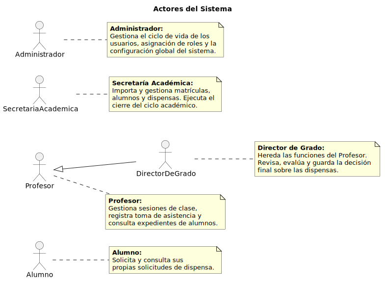
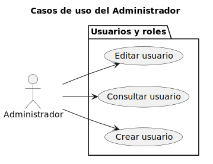
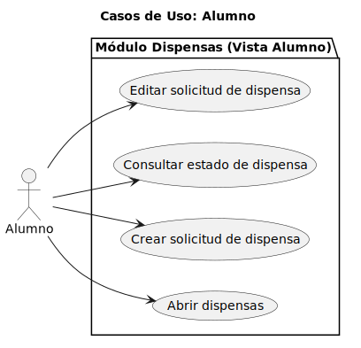
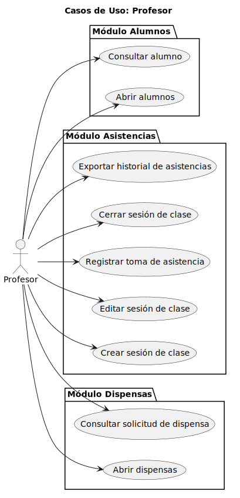
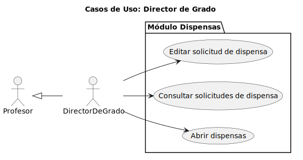
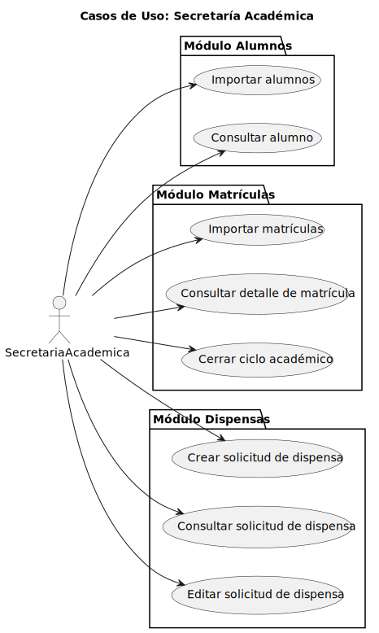

# CGU -- Actores y Casos de Uso

> | [Inicio](../../../README.md) | [Requisitado](../README.md) | **Actores y CU** |
> |---|---|---|

---

## Actores

 -- [Actores.puml](Actores.puml)

---

## Casos de uso por actor

| Actor | Diagrama | PUML |
|-------|----------|------|
| Administrador |  | [Administrador.puml](Administrador.puml) |
| Alumno |  | [Alumno.puml](Alumno.puml) |
| Profesor |  | [Profesor.puml](Profesor.puml) |
| DirectorDeGrado |  | [DirectorDeGrado.puml](DirectorDeGrado.puml) |
| SecretariaAcademica |  | [Secretaria.puml](Secretaria.puml) |

---

## Diagrama de contexto

 -- [DiagramaDeContexto.puml](DiagramaDeContexto.puml)
