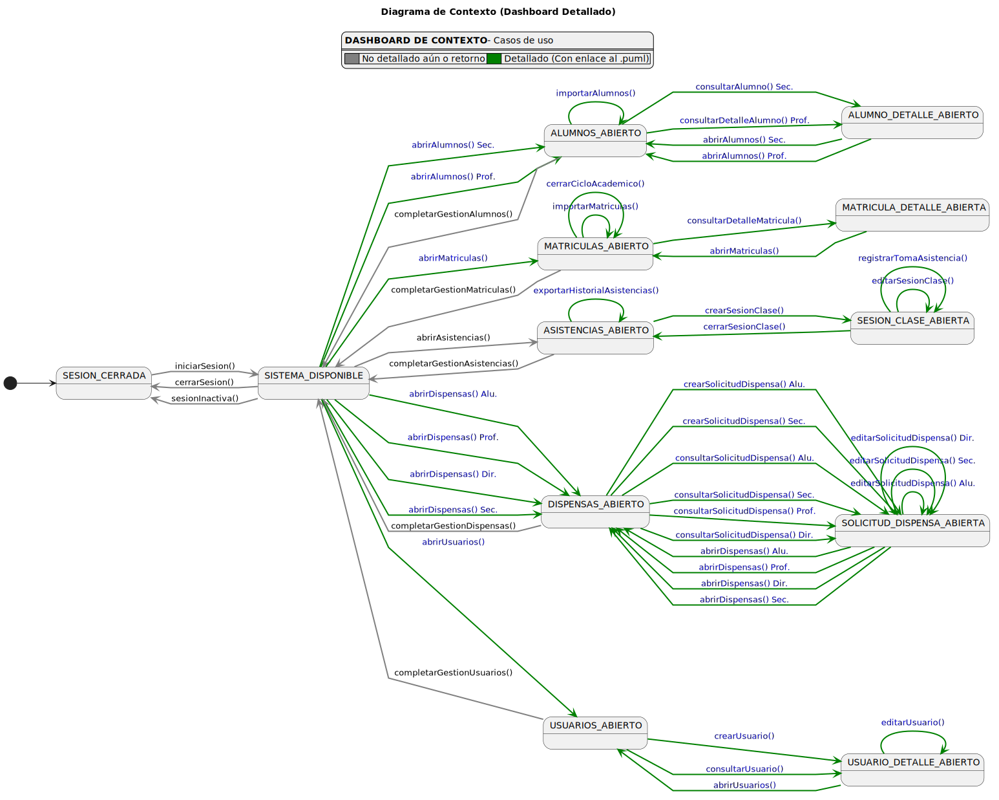

# Actores y Casos de Uso

> | [Inicio](../../../README.md) | [Requisitado](../README.md) | [Modelo del Dominio](../00-modelo-del-dominio/README.md) | **Actores y CUs** | [Detallado CUs](../02-detalle/README.md) |
> |---|---|---|---|---|

Actores del sistema e identificación de casos de uso por actor, junto con el diagrama de contexto que describe las transiciones de estado del sistema.

---

## Actores

|  |
| :--- |
| [Código UML](Actores.puml) |

---

## Casos de Uso por Actor

### Administrador

|  |
| :--- |
| [Código UML](Administrador.puml) |

### Alumno

|  |
| :--- |
| [Código UML](Alumno.puml) |

### Director de Grado

|  |
| :--- |
| [Código UML](DirectorDeGrado.puml) |

### Profesor

|  |
| :--- |
| [Código UML](Profesor.puml) |

### Secretaria

|  |
| :--- |
| [Código UML](Secretaria.puml) |

---

## Diagrama de Contexto (Vista General)

|  |
| :--- |
| [Código UML](DiagramaDeContexto.puml) |

## Diagrama de Contexto (Dashboard Detallado)

|  |
| :--- |
| [Código UML](DiagramaDeContextoDetallado.puml) |
