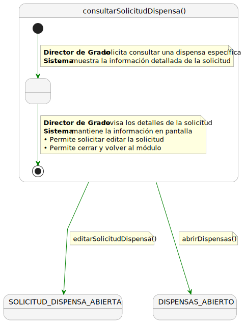
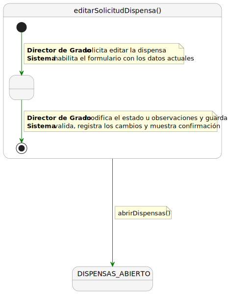

# CGU -- Detalle > DirectorDeGrado

> | [Inicio](../../../../README.md) | [Requisitado](../../README.md) | [Detalle](../README.md) | **DirectorDeGrado** |
> |---|---|---|---|

Nota: nombres de archivo tal cual en CGU (PUML y SVG no siempre coinciden).

| Caso de uso | SVG | PUML |
|-------------|-----|------|
| ConsultarSolicitudesDispensas |  | [ConsultarSolicitudesDispensas.puml](ConsultarSolicitudesDispensas.puml) |
| EditarSolicitudDispensa |  | [EditarSolicitud.puml](EditarSolicitud.puml) |