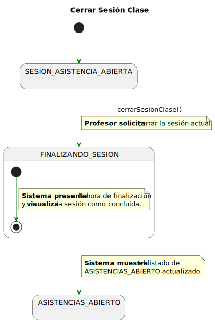
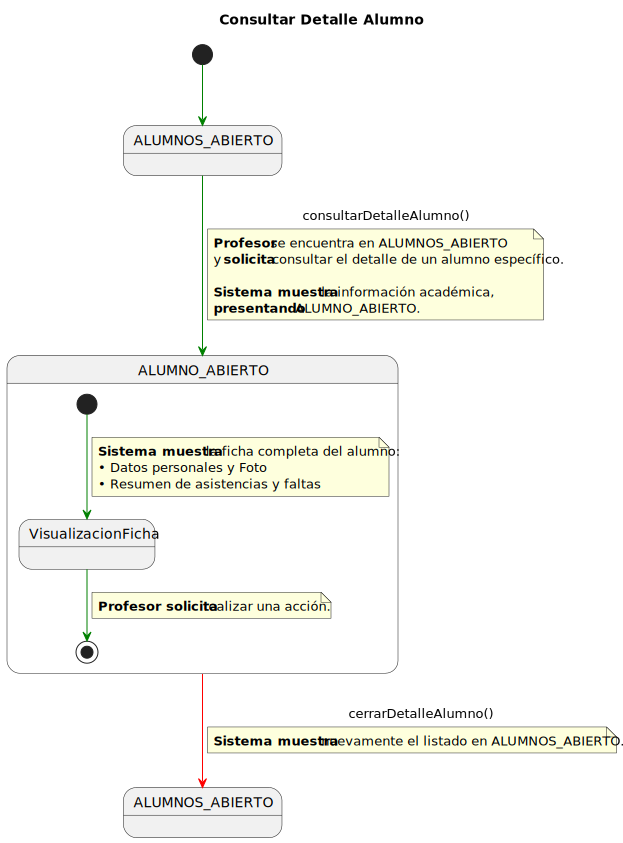
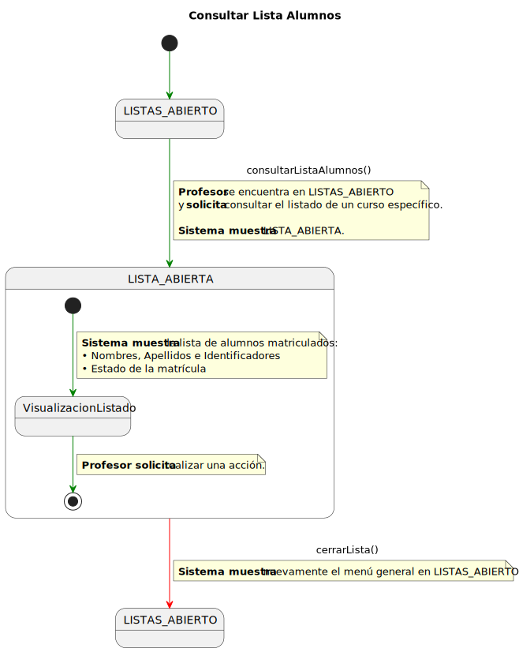
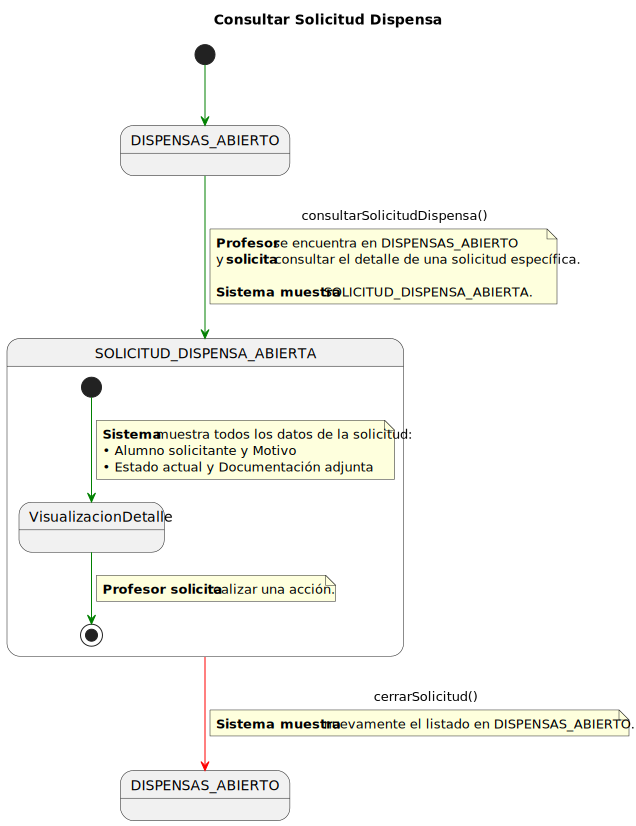
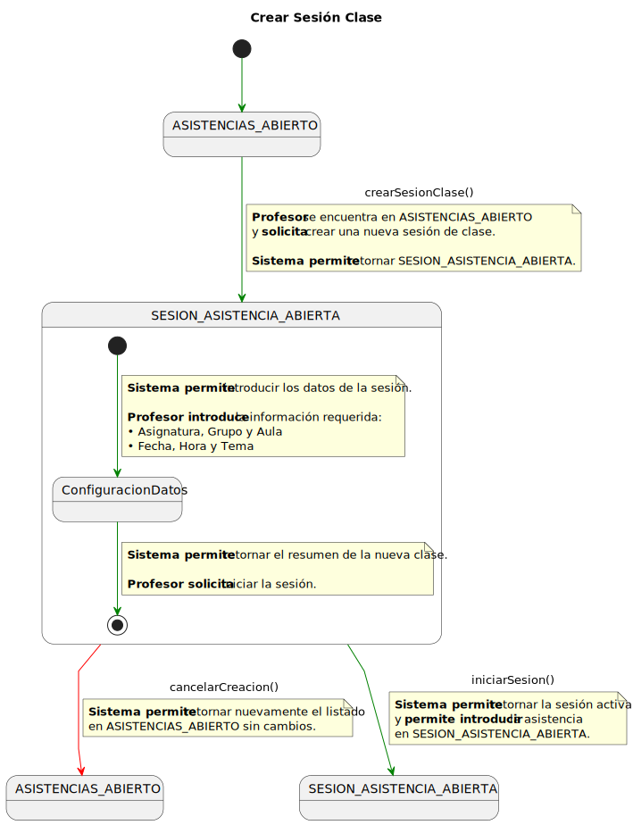
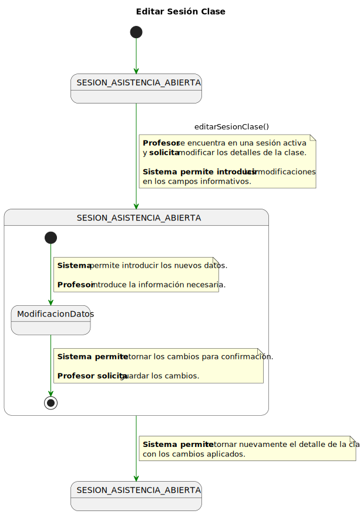
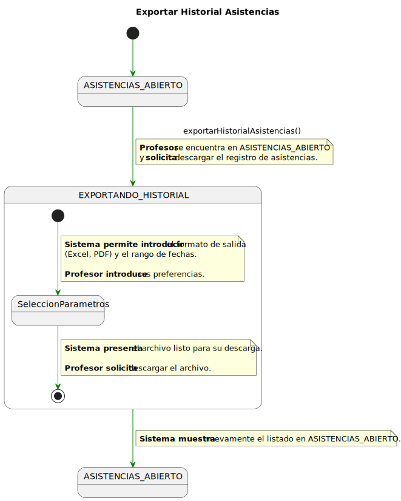
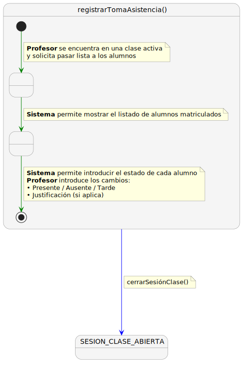

# CGU -- Detalle > Profesor

> | [Inicio](../../../../README.md) | [Requisitado](../../README.md) | [Detalle](../README.md) | **Profesor** |
> |---|---|---|---|

| Caso de uso | SVG | PUML |
|-------------|-----|------|
| cerrarSesionClase |  | [cerrarSesionClase.puml](cerrarSesionClase.puml) |
| consultarDetalleAlumno |  | [consultarDetalleAlumno.puml](consultarDetalleAlumno.puml) |
| consultarListaAlumnos |  | [consultarListaAlumnos.puml](consultarListaAlumnos.puml) |
| consultarSolicitudDispensa |  | [consultarSolicitudDispensa.puml](consultarSolicitudDispensa.puml) |
| crearSesionClase |  | [crearSesionClase.puml](crearSesionClase.puml) |
| editarSesionClase |  | [editarSesionClase.puml](editarSesionClase.puml) |
| exportarHistorialAsistencias |  | [exportarHistorialAsistencias.puml](exportarHistorialAsistencias.puml) |
| registrarTomaAsistencia |  | [registrarTomaAsistencia.puml](registrarTomaAsistencia.puml) |