# CGU — Detallado de Casos de Uso

> | [Inicio](../../../README.md) | [Requisitado](../README.md) | [Modelo del Dominio](../00-modelo-del-dominio/README.md) | [Actores y CUs](../01-actores-casos-uso/README.md) | **Detallado CUs** |
> |---|---|---|---|---|

---

## Administrador

### Abrir Usuarios [Administrador]

| 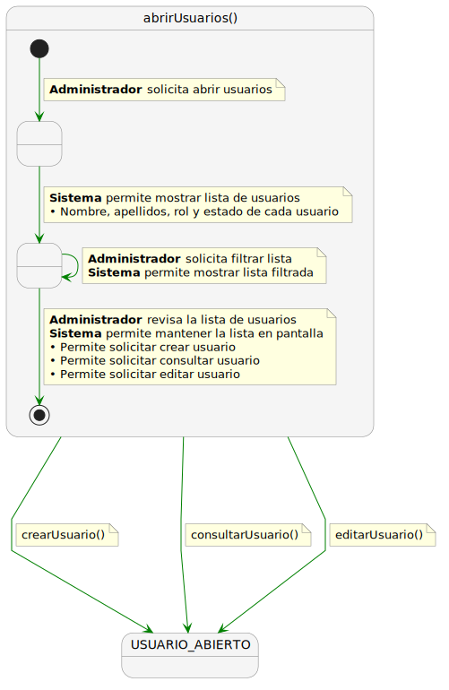 |
| :--- |
| [Código UML](Administrador/abrirUsuarios.puml) |

### Consultar Usuario [Administrador]

|  |
| :--- |
| [Código UML](Administrador/consultarUsuario.puml) |

### Crear Usuario [Administrador]

|  |
| :--- |
| [Código UML](Administrador/crearUsuario.puml) |

### Editar Usuario [Administrador]

|  |
| :--- |
| [Código UML](Administrador/editarUsuario.puml) |

---

## Alumno

### Abrir Dispensas [Alumno]

| 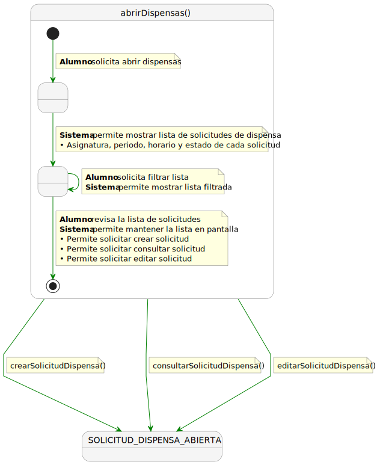 |
| :--- |
| [Código UML](Alumno/abrirDispensas.puml) |

### Consultar Solicitud Dispensa [Alumno]

| 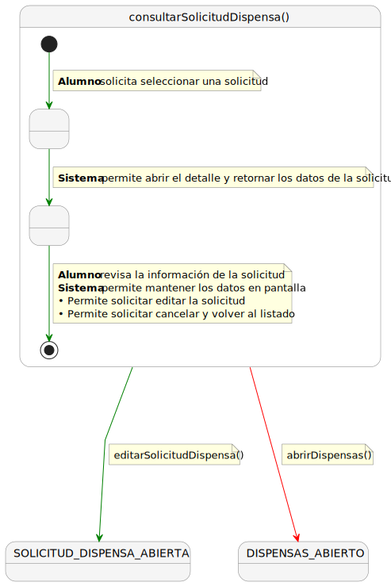 |
| :--- |
| [Código UML](Alumno/consultarSolicitudDispensa.puml) |

### Crear Solicitud Dispensa [Alumno]

| 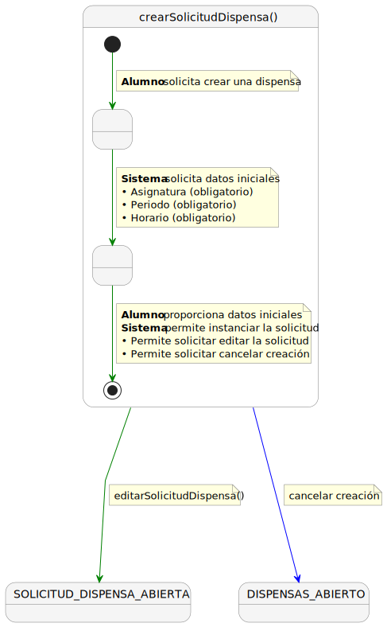 |
| :--- |
| [Código UML](Alumno/crearSolicitudDispensa.puml) |

### Editar Solicitud Dispensa [Alumno]

| 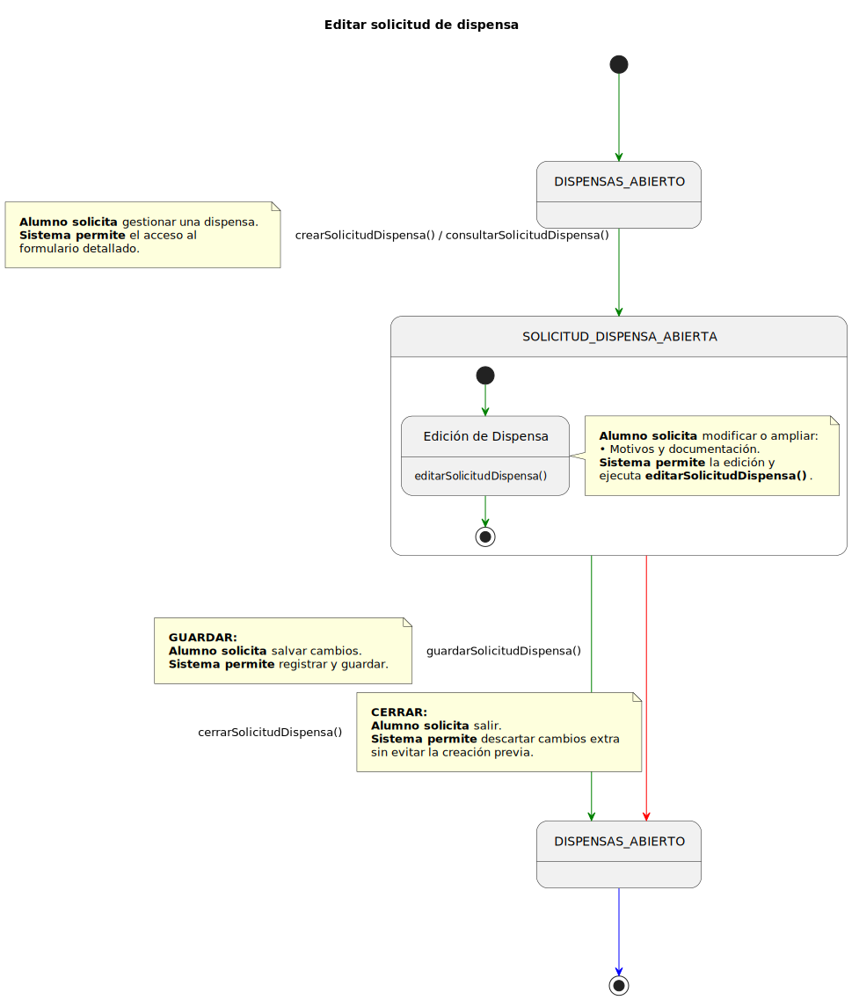 |
| :--- |
| [Código UML](Alumno/editarSolicitudDispensa.puml) |

---

## Director de Grado

### Abrir Dispensas [Director de Grado]

| 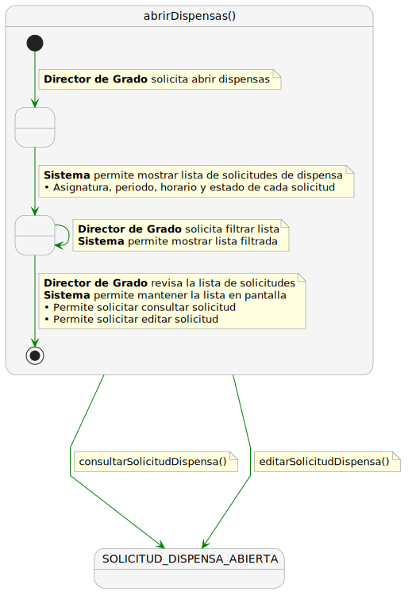 |
| :--- |
| [Código UML](DirectorDeGrado/abrirDispensas.puml) |

### Consultar Solicitud Dispensa [Director de Grado]

|  |
| :--- |
| [Código UML](DirectorDeGrado/consultarSolicitudDispensa.puml) |

### Editar Solicitud Dispensa [Director de Grado]

|  |
| :--- |
| [Código UML](DirectorDeGrado/editarSolicitudDispensa.puml) |

---

## Profesor

### Abrir Alumnos [Profesor]

| 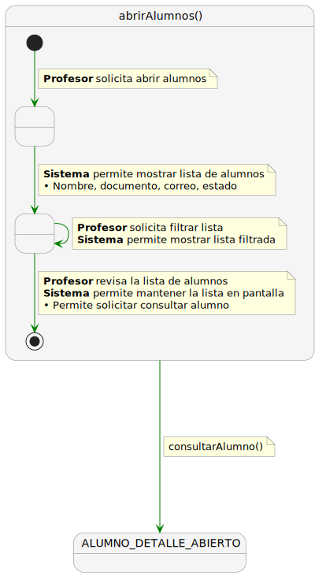 |
| :--- |
| [Código UML](Profesor/abrirAlumnos.puml) |

### Abrir Dispensas [Profesor]

| 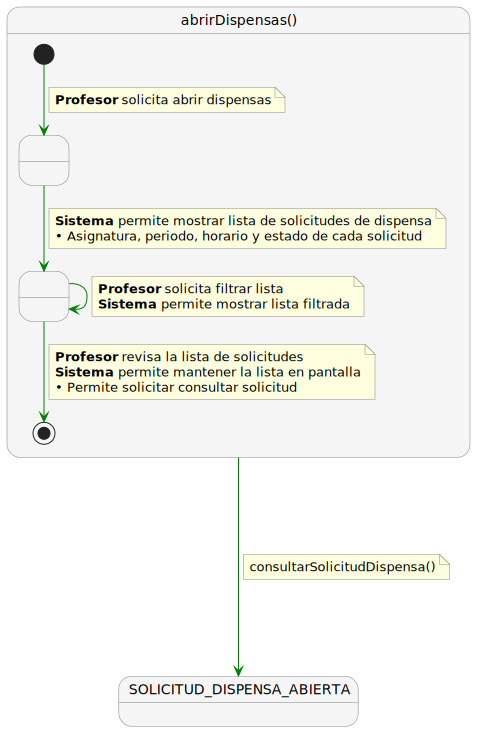 |
| :--- |
| [Código UML](Profesor/abrirDispensas.puml) |

### Cerrar Sesion Clase [Profesor]

|  |
| :--- |
| [Código UML](Profesor/cerrarSesionClase.puml) |

### Consultar Detalle Alumno [Profesor]

|  |
| :--- |
| [Código UML](Profesor/consultarDetalleAlumno.puml) |

### Consultar Solicitud Dispensa [Profesor]

|  |
| :--- |
| [Código UML](Profesor/consultarSolicitudDispensa.puml) |

### Crear Sesion Clase [Profesor]

|  |
| :--- |
| [Código UML](Profesor/crearSesionClase.puml) |

### Editar Sesion Clase [Profesor]

|  |
| :--- |
| [Código UML](Profesor/editarSesionClase.puml) |

### Exportar Historial Asistencias [Profesor]

|  |
| :--- |
| [Código UML](Profesor/exportarHistorialAsistencias.puml) |

### Registrar Toma Asistencia [Profesor]

|  |
| :--- |
| [Código UML](Profesor/registrarTomaAsistencia.puml) |

---

## Secretaria

### Abrir Alumnos [Secretaria]

| 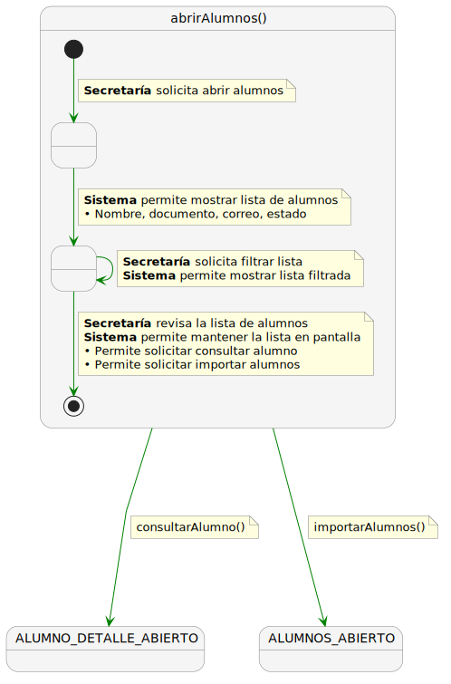 |
| :--- |
| [Código UML](Secretaria/abrirAlumnos.puml) |

### Abrir Dispensas [Secretaria]

| 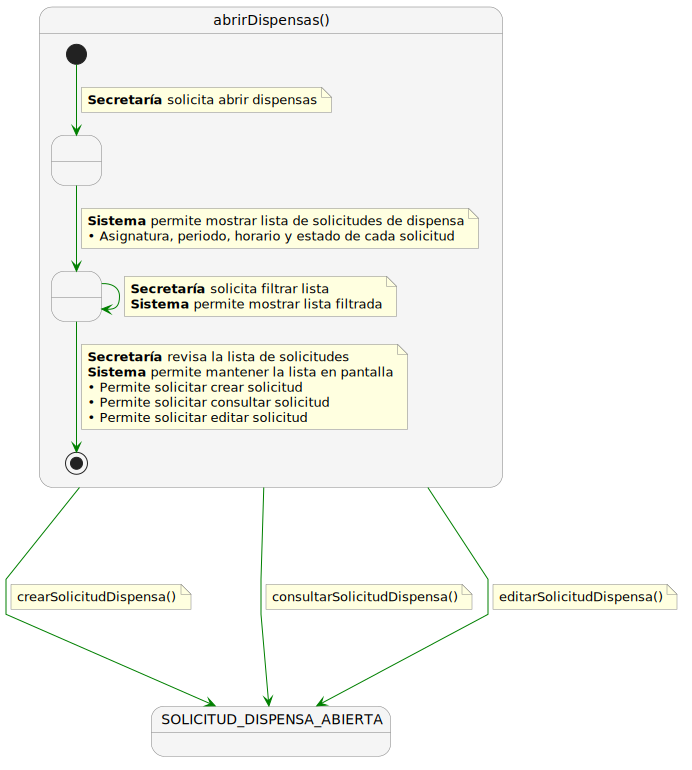 |
| :--- |
| [Código UML](Secretaria/abrirDispensas.puml) |

### Abrir Matriculas [Secretaria]

| 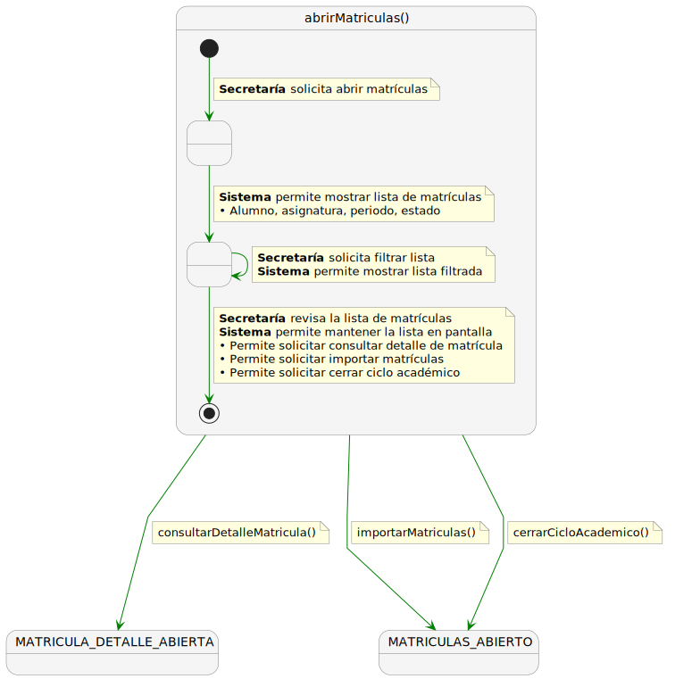 |
| :--- |
| [Código UML](Secretaria/abrirMatriculas.puml) |

### Cerrar Ciclo Academico [Secretaria]

|  |
| :--- |
| [Código UML](Secretaria/cerrarCicloAcademico.puml) |

### Consultar Alumno [Secretaria]

|  |
| :--- |
| [Código UML](Secretaria/consultarAlumno.puml) |

### Consultar Detalle Matricula [Secretaria]

|  |
| :--- |
| [Código UML](Secretaria/consultarDetalleMatricula.puml) |

### Consultar Solicitud Dispensa [Secretaria]

|  |
| :--- |
| [Código UML](Secretaria/consultarSolicitudDispensa.puml) |

### Crear Solicitud Dispensa [Secretaria]

|  |
| :--- |
| [Código UML](Secretaria/crearSolicitudDispensa.puml) |

### Editar Solicitud Dispensa [Secretaria]

|  |
| :--- |
| [Código UML](Secretaria/editarSolicitudDispensa.puml) |

### Importar Alumnos [Secretaria]

|  |
| :--- |
| [Código UML](Secretaria/importarAlumnos.puml) |

### Importar Matriculas [Secretaria]

|  |
| :--- |
| [Código UML](Secretaria/importarMatriculas.puml) |
