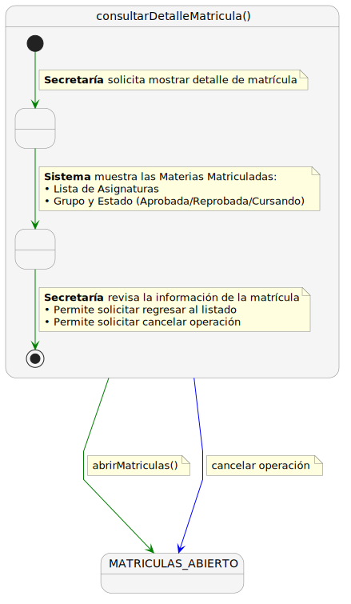
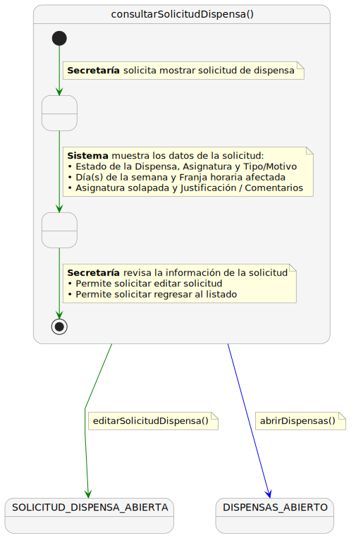
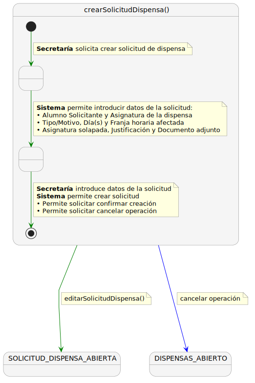
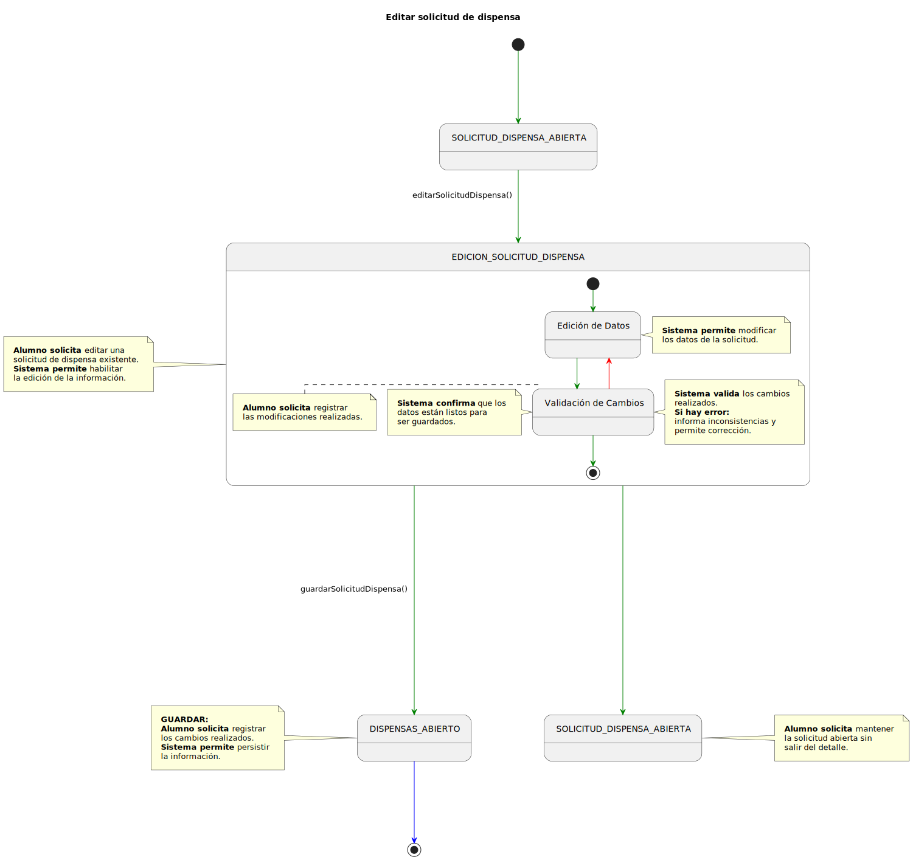
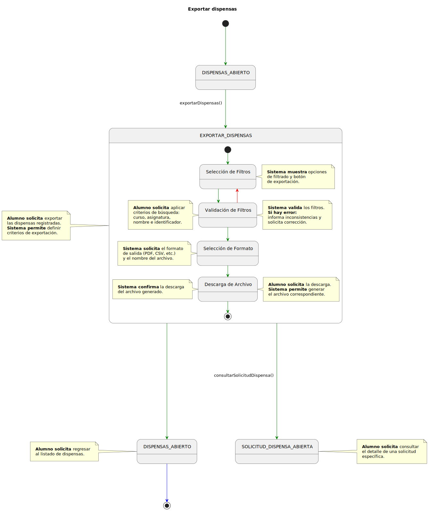
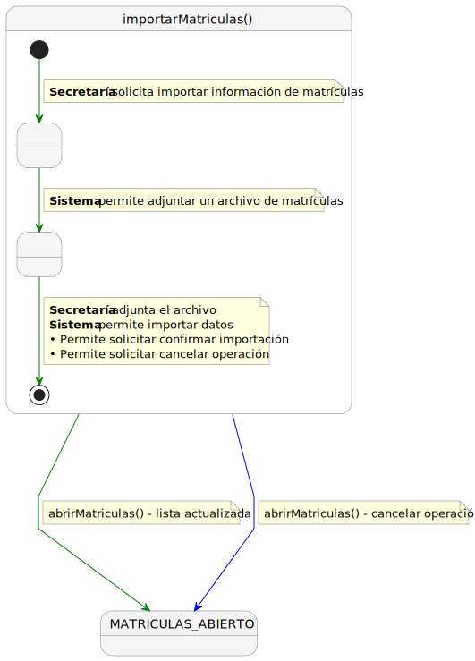

# CGU -- Detalle > Secretaria

> | [Inicio](../../../../README.md) | [Requisitado](../../README.md) | [Detalle](../README.md) | **Secretaria** |
> |---|---|---|---|

Nota: importarMatricula.puml / importarMatriculas.svg tal cual en CGU.

| Caso de uso | SVG | PUML |
|-------------|-----|------|
| consultarDetalleMatricula |  | [consultarDetalleMatricula.puml](consultarDetalleMatricula.puml) |
| consultarListaAlumnos |  | [consultarListaAlumnos.puml](consultarListaAlumnos.puml) |
| consultarSolicitudDispensa |  | [consultarSolicitudDispensa.puml](consultarSolicitudDispensa.puml) |
| crearSolicitudDispensa |  | [crearSolicitudDispensa.puml](crearSolicitudDispensa.puml) |
| editarSolicitudDispensa |  | [editarSolicitudDispensa.puml](editarSolicitudDispensa.puml) |
| exportarDispensas |  | [exportarDispensas.puml](exportarDispensas.puml) |
| importarListasAlumnos |  | [importarListasAlumnos.puml](importarListasAlumnos.puml) |
| importarMatricula/s |  | [importarMatricula.puml](importarMatricula.puml) |